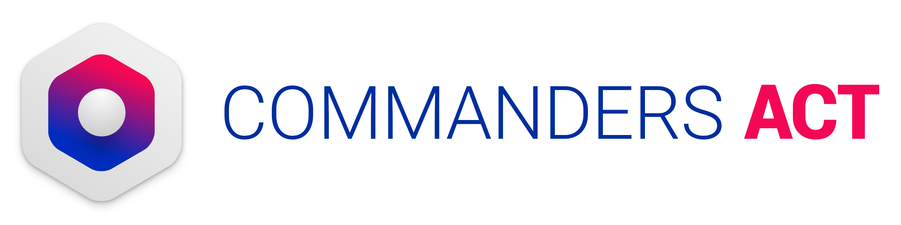
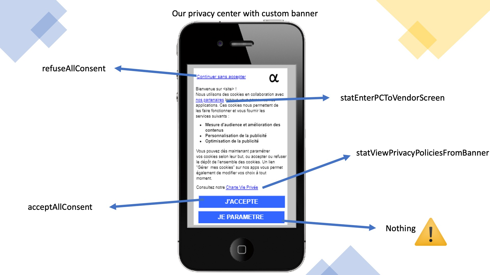
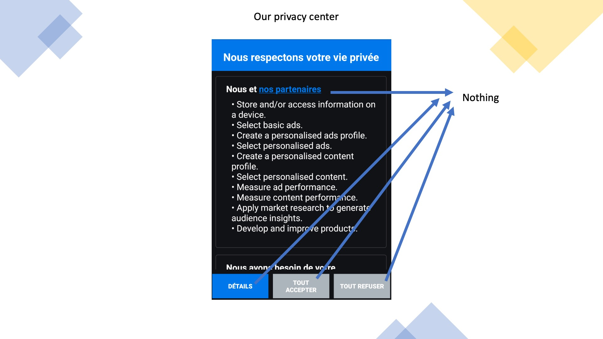
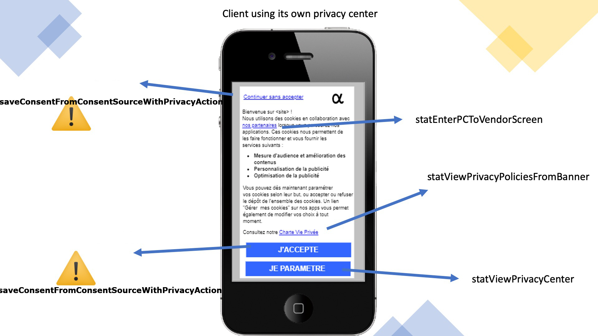
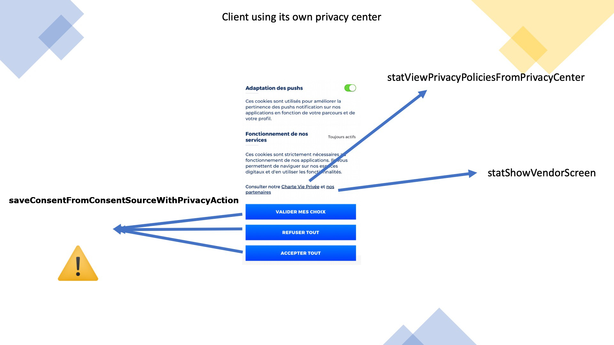

<html>
<body>
<p></p>
<h1 id="consents-implementation-guide">Consent's Implementation Guide</h1>
<p><strong>iOS</strong></p>
<p>Last update : <em>06/05/2024</em><br />
Release version : <em>5.3.1</em></p>
<p><div id="end_first_page" /></p>

<div class="toc">
<ul>
<li><a href="#consents-implementation-guide">Consent's Implementation Guide</a></li>
<li><a href="#introduction">Introduction</a><ul>
<li><a href="#choose-your-privacy">Choose your privacy</a></li>
<li><a href="#setup">Setup</a><ul>
<li><a href="#with-the-serverside">With the ServerSide</a></li>
<li><a href="#standalone">Standalone</a></li>
</ul>
</li>
<li><a href="#saving-consent">Saving consent</a><ul>
<li><a href="#with-the-privacy-center">With the Privacy Center</a></li>
<li><a href="#manually-displayed-consent">Manually displayed consent</a></li>
<li><a href="#forwarding-to-server-side">Forwarding to Server-Side</a></li>
<li><a href="#acceptall-refuseall">AcceptAll / RefuseAll</a></li>
</ul>
</li>
<li><a href="#retaining-consent">Retaining consent</a><ul>
<li><a href="#using-your-own-user-id">Using your own user ID</a></li>
<li><a href="#displaying-chosen-id">Displaying chosen ID</a></li>
</ul>
</li>
<li><a href="#displaying-consent">Displaying consent</a></li>
<li><a href="#reacting-to-consent">Reacting to consent</a></li>
<li><a href="#forwarding-consent-to-webviews">Forwarding consent to webViews</a></li>
<li><a href="#forwarding-consent-to-firebaseanalytics">Forwarding consent to FirebaseAnalytics :</a><ul>
<li><a href="#debug-google-consent-mode">Debug Google Consent Mode :</a></li>
</ul>
</li>
<li><a href="#changing-consent-version">Changing consent version</a></li>
<li><a href="#consent-internal-api">Consent internal API</a></li>
<li><a href="#privacy-center">Privacy Center</a><ul>
<li><a href="#change-the-default-state-of-the-switch-button-to-disabled">Change the default state of the switch button to disabled:</a></li>
</ul>
</li>
<li><a href="#privacy-statistics">Privacy statistics</a></li>
<li><a href="#stop-privacy-stats-tracking">Stop privacy stats tracking</a></li>
<li><a href="#tcdemo">TCDemo</a></li>
</ul>
</li>
<li><a href="#support-and-contacts">Support and contacts</a></li>
</ul>
</div>
<h1 id="introduction">Introduction</h1>
<p>The Consent module can be used in a lot of different ways, after this short introduction, you will find links to each of the different ways and their specific documentations.</p>
<p>Having the user consent is essential to send sensible information like the IDFA/AAID or using any personal information to serve advertising.</p>
<p>We created this module to simplify the management of your user's privacy and the way to use it.</p>
<p>This module can:</p>
<pre><code>- Display a consent page (if needed)
- Save consent inside the phone and reload it every time the application is launched.
- Check the validity of the consent. The validity duration is set to 6 months by default.
- Send a hit to our servers to record the consent. For statisical purposes.
- Save the consent String (if used alongside IAB)
- Enable or disable the ServerSide. (if used alongside the ServerSide module)
- Add the categories automatically to the hits the ServerSide sends. (if used alongside the ServerSide module)
- Forward the consent to the developpers if they need it outside of the module.
</code></pre>
<h2 id="choose-your-privacy">Choose your privacy</h2>
<p>Consent comes with two major flavors:</p>
<pre><code>- With Tag Management (With ServerSide)
- Standalone
</code></pre>
<p>And 3 different ways to display it:</p>
<pre><code>- Manually and then forwarding us the information
- Using our Privacy Center for IAB version 2
- Using our Privacy Center for simple Consent solution
</code></pre>
<p>If you're unsure of which one you should use, please contact the person in charge of your account.</p>
<p><a href="../TCIAB/README.md">To use IAB V2 please see here</a></p>
<h2 id="setup">Setup</h2>
<p>/!\ If you are using our interface, you need to have a version of privacy.json inside your project. This will prevent any issues with users with bad or no internet at all. If you are using IAB please also take vendor-list.json and the translation file purposes-fr.json.
If you are not using our interface, you can't use our privacy.json, if you want a way to use a configuration file, please ask your dev team to manage this file.</p>
<p>After initialisation the Consent module will check the consent validity. If the consent is too old a callback will be called. Please check the Callback part.
The default value is 6 months.</p>
<p>If you're using our interface, and thus our privacy.json, you can change the duration on this validity.
To do this, add "consentDurationInMonths": "13" inside the "information" bloc.</p>
<p>If you're not using our interface, you'll have to manually change it in the code.
We express this duration in months. The duration of a month is calculated by 365/12 days.
Please first call the following method before initializing the Consent module else:</p>
<pre><code>[[TCMobileConsent sharedInstance] setConsentDuration: 13];
</code></pre>
<p>in swift : </p>
<pre><code>TCMobileConsent.sharedInstance().consentDuration = 13
</code></pre>
<h3 id="with-the-serverside">With the ServerSide</h3>
<p>Modules: Core, Consent, ServerSide</p>
<p>This module can use the same model you are using on the web, if you do so, please start by getting the IDs of the categories you are going to use.
Join those IDs with a "consent version". Default is 1, but if you change the implementation, increment this version.</p>
<p>The setup is really simple, pass to the TCMobileConsent object your site ID and privacy ID. If you want to add your consent version, you can add it to the parameters as a NSString.
in objective-c : </p>
<pre><code>[[TCMobileConsent sharedInstance] setSiteID: siteID andPrivacyID: privacyID];
</code></pre>
<p>in swift : </p>
<pre><code>TCMobileConsent.sharedInstance().setSiteID(siteID, andPrivacyID: privacyID)
</code></pre>
<p>If you're using you're own Privacy Center, use the following function instead:</p>
<p>in objective-c : </p>
<pre><code>[[TCMobileConsent sharedInstance] customPCMSetSiteID: siteID andPrivacyID: privacyID];
</code></pre>
<p>in swift : </p>
<pre><code>TCMobileConsent.sharedInstance().customPCMSetSiteID(siteID, andPrivacyID: privacyID)
</code></pre>
<p>This call will check the saved consent, putting the SDK on hold if nothing is fount, and start/stop the SDK if something is saved.
It will then the check the consent validity, if it's too old, you can implement a callback treating what to do then. Please check the Callback part.</p>
<p>Please note that start and stop have a notification sent with them, you can listen to them if needed: kTCNotification_EnablingTheServerSide and kTCNotification_StoppingTheServerSide.</p>
<p>If you need to store configuration files in another bundle than the main one, you can call the following line:</p>
<p>It must be called <em>before</em> calling any [TCMobileConsent sharedInstance].</p>
<p>in objective-c : </p>
<pre><code>[[TCConfigurationFileFactory sharedInstance] setBundle: myBundle forConfiguration: @"vendorlist"];
</code></pre>
<p>in swift : </p>
<pre><code>TCConfigurationFileFactory.sharedInstance().setBundle(myBundle, forConfiguration: "vendorlist")
</code></pre>
<h3 id="standalone">Standalone</h3>
<p>Modules: Core, Consent</p>
<p>You won't need the ServerSide module, and will need to implement a callback to manage your solutions when consent is given or re-loaded.</p>
<p>The setup is really simple, pass to the TCMobileConsent object your site ID  and privacyID.</p>
<p>in objective-c : </p>
<pre><code>[[TCMobileConsent sharedInstance] setSiteID: siteID andPrivacyID: privacyID];
</code></pre>
<p>in swift : </p>
<pre><code>TCMobileConsent.sharedInstance().setSiteID(siteID, andPrivacyID: privacyID)
</code></pre>
<p>If you're using you're own Privacy Center, use the following function instead:</p>
<p>in objective-c : </p>
<pre><code>[[TCMobileConsent sharedInstance] customPCMSetSiteID: siteID andPrivacyID: privacyID];
</code></pre>
<p>in swift : </p>
<pre><code>TCMobileConsent.sharedInstance().customPCMSetSiteID(siteID, andPrivacyID: privacyID)
</code></pre>
<h2 id="saving-consent">Saving consent</h2>
<p>Here is where the IDs of the categories matters.</p>
<h3 id="with-the-privacy-center">With the Privacy Center</h3>
<p>If you're using the Privacy Center, nothing has to be done here, it will automatically propagate the consent to all other systems. And the ID will be the one used in the configuration file. Please check the Privacy Center part for more information.</p>
<p>Please keep your category IDs between 1 and 999.</p>
<h3 id="manually-displayed-consent">Manually displayed consent</h3>
<p>Once the user validated his consent, you can then send the information to the Consent module as follows:
in objective-c : </p>
<pre><code>NSMutableDictionary *consent = [[NSMutableDictionary alloc] initWithCapacity: 3];
[consent setObject: @"1" forKey: @"PRIVACY_CAT_1"];
[consent setObject: @"0" forKey: @"PRIVACY_CAT_2"];
[consent setObject: @"2" forKey: @"PRIVACY_CAT_3"];
[[TCMobileConsent sharedInstance] saveConsent: consent fromConsentSource: Popup withPrivacyAction: Save];
</code></pre>
<p>ETCConsentSource is either "Popup" or "PrivacyCenter".</p>
<p>ETCConsentAction is either "AcceptAll", "RefuseAll", "Save"</p>
<p>in swift : </p>
<pre><code>let consent = ["PRIVACY_CAT_1" : "1", "PRIVACY_CAT_2" : "0", "PRIVACY_CAT_3" : "2"];
TCMobileConsent.sharedInstance().save(consent, from: ETCConsentSource.Popup, withPrivacyAction: ETCConsentAction.Save)
</code></pre>
<p>Please prefix your category IDs with "PRIVACY_CAT_" and your vendor IDs with "PRIVACY_VEN_.</p>
<p>The value expected are:</p>
<ul>
<li>1 means accepting this category or vendor.</li>
<li>2 is for mandatory vendors or categories.</li>
<li>0 is refusing.</li>
</ul>
<p>Source can be either:
- Popup
- PrivacyCenter</p>
<p>And consent action:
- AcceptAll
- RefuseAll
- Save</p>
<p>If you're using the ServerSide, this will propagate the information to the TCServerSide and the TCUser and manage its state.</p>
<p>If you are using mandatory categories (categories that can't be opted out), you can use refuse all and pass those categories with "2".</p>
<h3 id="forwarding-to-server-side">Forwarding to Server-Side</h3>
<p>Only if you use Server-Side and a consent manually displayed and consent external to our platform. 
Otherwise, everything is done automatically, so nothing to do here.</p>
<p>You will need to add consent to the TCUser object to forward it to our server-side.</p>
<p>in objective-c : </p>
<pre><code>NSMutableDictionary *ext = [[NSMutableDictionary alloc] init];
[ext setValue: @"true" forKey: @"key01"];
[ext setValue: @"1" forKey: @"key02"];
[ext setValue: @"3" forKey: @"312"];
[[TCUser sharedInstance] setExternalConsent: ext];
</code></pre>
<p>in swift : </p>
<pre><code>let ext = ["key01" : "true", "key02" : "1", "312" : "3"];'
TCUser.sharedInstance().setExternalConsent(ext)
</code></pre>
<p>Since it's external, and we don't really know how it's working, you can pass any string/string and we'll forward it as is.</p>
<h3 id="acceptall-refuseall">AcceptAll / RefuseAll</h3>
<p>/!\ Those methods only work if you are using our interface and thus have a privacy.json in your project (and maybe IAB's JSON as well).</p>
<p>Those are intended for clients that are displaying a first "popup" screen before our interfaces and that have a way to either open the privacy center of accept/refuse the consent.</p>
<p>We created functions to call if you want to create a simple way to accept or refuse all consent from outside our user interface.</p>
<p>objective-c :</p>
<pre><code>[[TCMobileConsent sharedInstance] acceptAllConsent];
[[TCMobileConsent sharedInstance] refuseAllConsent];
</code></pre>
<p>in swift : </p>
<pre><code>TCMobileConsent.sharedInstance().acceptAllConsent()
TCMobileConsent.sharedInstance().refuseAllConsent()
</code></pre>
<h2 id="retaining-consent">Retaining consent</h2>
<p>The saving of the consent on our servers is done automatically.</p>
<p>But since we are saving the consent in our servers, we need to identify the user one way or another. By default, the variable used to identify the user consenting is #TC_SDK_ID#, but you can change it to anything you'd like.</p>
<p>If you're looking for a way to prove consent or reset saved information, you'll need to create a specific screen in app for this.</p>
<p>This can be used to save the display of the consent, and giving the consent.</p>
<p>This ID is very important because it will be the basic information used to get back the consent when you need a proof.</p>
<h3 id="using-your-own-user-id">Using your own user ID</h3>
<p>You will be able to get the information more easily since this is an ID available by several means for you.
You will be able to get the information more easily since this is an ID available by several means for you.
To modify the ID used for saving the consent, you can change the information inside the TCUSer.</p>
<p>in objective-c :</p>
<pre><code>[TCUser sharedInstance].consentID = @"myConsentID";
</code></pre>
<p>in swift :</p>
<pre><code>TCUser.sharedInstance().consentID = "myConsentID"
</code></pre>
<h3 id="displaying-chosen-id">Displaying chosen ID</h3>
<p>You might want to be able to display to your end user the ID used to save the consent. You can simply get it like this:</p>
<pre><code>[TCUser sharedInstance].consentID
</code></pre>
<h2 id="displaying-consent">Displaying consent</h2>
<p>If you are familiar with Commanders Act Consent for web, you know that we actually record two things. The first thing is "displaying the consent form".
This allows you to prove that a user has indeed been shown the consent screen even if he somehow left without accepting/refusing to give his consent.</p>
<p>In some cases, client also use this to infer user consent since he continued using the application after he was shown the consent screen.
We don't recommend this behaviour, please discuss it with your setup team first.</p>
<h2 id="reacting-to-consent">Reacting to consent</h2>
<p>If you need to react to the user giving consent, or the loading of the consent at the start of the Consent module we created several callbacks to help.</p>
<p>Currently, we have a callback function that lets you get back the categories and set up your other partners accordingly.
This is the function where you would tell your ad partner "the user don't want to receive personalized ads" for example.</p>
<p>/!\ Don't forget to register to the callbacks <em>before</em> the initialisation of the Consent Module since the module will check consent at init and use the callback at this step.</p>
<p>Implement TCPrivacyCallbacks to get access to those callbacks:</p>
<pre><code>- (void) consentUpdated: (NSDictionary *) consent;
</code></pre>
<p>Called when you give us the user selected consents, or when we load the saved consent from the SDK.
We have a Dictionnary which is the same as the one given to our SDK with keys PRIVACY_CAT_n and value @"0" or @"1".</p>
<pre><code>- (void) consentOutdated;
</code></pre>
<p>This is called after 13 months without change in the user consent. This can allow you to force displaying the consent the same way you would on first launch.</p>
<pre><code>- (void) consentCategoryChanged;
</code></pre>
<p>When you make a change in the JSON, there is nothing special to do.
But when this change is adding or removing a category, or changing an ID, we should re-display the Privacy Center.</p>
<pre><code>- (void) significantChangesInPrivacy;
</code></pre>
<p>This one is slightly different from the last one, it was created for IAB and will not be sent automatically. It is conditionned by the field "significantChanges" in the privacy.json so that it will only launch when you need it to.</p>
<h2 id="forwarding-consent-to-webviews">Forwarding consent to webViews</h2>
<p>Some clients need to have the consent forwarded in their webViews to manage a web container inside it.
We created a function to get the privacy as a JSON string so you can save it inside the webView's local storage.
/!\ This function only help to save it to the local storage by giving the required format, you will still need to have JS code in the web container to use it. Please ask your consultant for this part.</p>
<pre><code>- (NSString *) getConsentAsJson;
</code></pre>
<h2 id="forwarding-consent-to-firebaseanalytics">Forwarding consent to FirebaseAnalytics :</h2>
<p>If you want to use our TCConsent to collect and set your Google Consent Mode, you can configure the TCConsent module to forward and set the consent to FirebaseAnalytics once the user has opted-in/out for your mapped categories. </p>
<p>To do so, make sure FirebaseAnalytics library is added and correctly configured into your project (check Google documentation). 
Then add the following section to the root of your privacy.json : </p>
<p><code>"google_consent_mode": {
        "use_consent_mode": true, // boolean value to activate the mapping
        "infer_ad_from_tcf": false, // boolean value for default IAB mapping
        "category_mapping": { // Custom categories ID mapping only
            "ad_storage": 1, 
            "ad_user_data": 2,
            "ad_personalization": 3,
            "analytics_storage": 4
        }
    }</code></p>
<p>You will need to implement the firebaseConsentChanged callback in your TCPrivacyCallbacks with the following code : </p>
<p>```
import FirebaseCore</p>
<p>class MyPrivacyCallbacks : NSObject, TCPrivacyCallbacks
{</p>
<p>/<strong> other code &amp; callbacks </strong>/ </p>
<pre><code>func firebaseConsentChanged(_ firebaseConsent: [String : NSNumber]!) 
{
    if let analytics_storage_consent = firebaseConsent["analytics_storage"]?.boolValue{
        Analytics.setConsent([.analyticsStorage: analytics_storage_consent ? .granted : .denied])
    }

    if let ad_storage_consent = firebaseConsent["ad_storage"]?.boolValue{
        Analytics.setConsent([.adStorage: ad_storage_consent ? .granted : .denied])
    }

    if let ad_user_data_consent = firebaseConsent["ad_user_data"]?.boolValue{
        Analytics.setConsent([.adUserData: ad_user_data_consent ? .granted : .denied])
    }

    if let ad_personalization_consent = firebaseConsent["ad_personalization"]?.boolValue{
        Analytics.setConsent([.adPersonalization: ad_personalization_consent ? .granted : .denied])
    }
}
</code></pre>
<p>}
```</p>
<p>Don't forget to set callbacks before initialising the TCConsent : </p>
<p><code>TCMobileConsent.sharedInstance().callback = MyPrivacyCallbacks()
        TCMobileConsent.sharedInstance().setSiteID(siteID, andPrivacyID: privacyID)</code></p>
<h3 id="debug-google-consent-mode">Debug Google Consent Mode :</h3>
<p>Once Consent is collected, you can look into firebase logs on Xcode console directly for new GCM categories consent values, more info <a href="https://developers.google.com/tag-platform/security/guides/app-consent?platform=ios">here</a>.</p>
<h2 id="changing-consent-version">Changing consent version</h2>
<p>If the case you need to manually change the consent version (if you're using your own privacy center for example), you can use the following:</p>
<p>in objective-c : </p>
<pre><code>[[TCMobileConsent sharedInstance] setConsentVersion: @"132"];
</code></pre>
<p>in swift : </p>
<pre><code>    TCMobileConsent.sharedInstance().consentVersion = "132"
</code></pre>
<h2 id="consent-internal-api">Consent internal API</h2>
<p>We created several methods to check given consent. They are simple, but make it easier to work with consent information at any given time.
You'll find those in the class TCConsentAPI:</p>
<pre><code>/**
 * Checks if we should display privacy center for any reason.
 * @return True or False.
 */
+ (BOOL) shouldDisplayPrivacyCenter
</code></pre>
<p>&nbsp;</p>
<pre><code>/**
 * Checks if consent has already been given by checking if consent information is saved.
 * @return YES if the consent was already given, NO otherwise.
 */
+ (BOOL) isConsentAlreadyGiven;
</code></pre>
<p>&nbsp;</p>
<pre><code>/**
 * Return the epochformatted timestamp of the last time the consent was saved.
 * @return epochformatted timestamp or 0.
 */
+ (unsigned long long) getLastTimeConsentWasSaved;
</code></pre>
<p>&nbsp;</p>
<pre><code>/**
 * Check if a Category has been accepted.
 * @param ID the category ID.
 * @return YES or NO.
 */
+ (BOOL) isCategoryAccepted: (int) catID;
</code></pre>
<p>&nbsp;</p>
<pre><code>/**
 * Check if a vendor has been accepted.
 * @param ID the vendor ID.
 * @return YES or NO.
 */
+ (BOOL) isVendorAccepted: (int) venID;
</code></pre>
<p>&nbsp;</p>
<pre><code>/**
 * Get the list of all accepted categories.
 * @return a List of PRIVACY_CAT_IDs.
 */
+ (NSArray&lt;NSString *&gt; *) getAcceptedCategories;
</code></pre>
<p>&nbsp;</p>
<pre><code>/**
 * Get the list of all accepted vendors.
 * @return a List of PRIVACY_VEN_IDs.
 */
+ (NSArray&lt;NSString *&gt; *) getAcceptedVendors;
</code></pre>
<p>&nbsp;</p>
<pre><code>/**
 * Get the list of everything that was accepted.
 * @return a List of PRIVACY_VEN_IDs and PRIVACY_CAT_IDs.
 */
+ (NSArray&lt;NSString *&gt; *) getAllAcceptedConsent;
</code></pre>
<p>&nbsp;</p>
<pre><code>/**
 * Check if a purpose has been accepted.
 * @param ID the purpose ID.
 * @return YES or NO
 */
+ (BOOL) isIABPurposeAccepted: (int) ID;
</code></pre>
<p>&nbsp;</p>
<pre><code>/**
 * Check if a vendor has been accepted.
 * @param ID the vendor ID.
 * @return YES or NO
 */
+ (BOOL) isIABVendorAccepted: (int) ID;
</code></pre>
<p>&nbsp;</p>
<pre><code>/**
 * Check if a special feature has been accepted.
 * @param ID the vendor ID.
 * @return YES or NO
 */
+ (BOOL) isIABSpecialFeatureAccepted: (int) ID;
</code></pre>
<p>&nbsp;</p>
<pre><code>/**
 * Get the list of all google vendor accepted.
 * @return a list of acm_IDs.
 */
+ (NSArray &lt;NSString *&gt; *) getAcceptedGoogleVendors;
</code></pre>
<p>&nbsp;</p>
<h2 id="privacy-center">Privacy Center</h2>
<p>The Privacy Center is represented by a JSON file that describes the interfaces that will be created by native code inside the application.</p>
<p>For now this JSON has to be created and managed manually. An offline version is mandatory inside the app and if you need to update it remotely you can have another version on our CDNs.
The module will check for updates of the file automatically.</p>
<p>Your account should have a consultant that will provide you the corresponding JSON for your project.</p>
<p>We create an UIViewController to create the privacy center view.
The offline JSON should be inside the project code folder.</p>
<pre><code>TCPrivacyCenterViewController *PCM = [[TCPrivacyCenterViewController alloc] init];
[self.navigationController pushViewController: PCM animated: YES];
</code></pre>
<p>Since we have a view controller, you can call it by pushing it. It's quite easy.</p>
<p>Some part of the Privacy Center can be customised with your code.</p>
<h3 id="change-the-default-state-of-the-switch-button-to-disabled">Change the default state of the switch button to disabled:</h3>
<p>in objective-c : </p>
<pre><code>[TCMobileConsent sharedInstance].switchDefaultState = NO;
</code></pre>
<p>in swift : </p>
<pre><code>TCMobileConsent.sharedInstance().switchDefaultState = true
</code></pre>
<h2 id="privacy-statistics">Privacy statistics</h2>
<p>We have dashboards that allow to have detailed statistics on the choices your users are making.
Depending on your app privacy configuration you might have to call some additional functions.</p>
<pre><code>- Custom « banner/popup » -&gt; our privacy center
- Custom « banner/popup » -&gt; Custom privacy center
- Directly to our privacy center
- Custom privacy center
</code></pre>
<p>Whenever saveConsent* is called you will need to provide the full list of purposes and vendors that have been consented to and refused.</p>
<p>We reworked saveConsent methods to only use one. If you are using the old functions they will still work for now.
Otherwise, please check the above section "Manually displayed consent" for how this method works.</p>
<p>Also, please note that you will need to call statViewBanner when you display your custom banner.</p>
<p>


</p>
<p>Copy/paste-able list of functions for our interfaces:</p>
<p>in objective-c :</p>
<pre><code>[[TCMobileConsent sharedInstance] refuseAllConsent];
[[TCMobileConsent sharedInstance] acceptAllConsent];
[[TCMobileConsent sharedInstance] statEnterPCToVendorScreen];
[[TCMobileConsent sharedInstance] statViewPrivacyPoliciesFromBanner];
[[TCMobileConsent sharedInstance] getNumberOfIABVendors];
</code></pre>
<p>in swift :</p>
<pre><code>TCMobileConsent.sharedInstance().refuseAllConsent()
TCMobileConsent.sharedInstance().acceptAllConsent()
TCMobileConsent.sharedInstance().statEnterPCToVendorScreen()
TCMobileConsent.sharedInstance().statViewPrivacyPoliciesFromBanner()
TCMobileConsent.sharedInstance().getNumberOfIABVendors()
</code></pre>
<p>Copy/paste-able list of functions for custom interfaces:</p>
<p>in objective-c :</p>
<pre><code>[[TCMobileConsent sharedInstance] saveConsent: (NSDictionary *) consent fromConsentSource: (enum ETCConsentSource) source withPrivacyAction: (enum ETCConsentAction) action];
[[TCMobileConsent sharedInstance] statEnterPCToVendorScreen];
[[TCMobileConsent sharedInstance] statViewPrivacyPoliciesFromBanner];
[[TCMobileConsent sharedInstance] statViewPrivacyPoliciesFromPrivacyCenter];
[[TCMobileConsent sharedInstance] statViewPrivacyCenter];
[[TCMobileConsent sharedInstance] statShowVendorScreen];
</code></pre>
<p>in swift :</p>
<pre><code>    TCMobileConsent.sharedInstance().save([AnyHashable : Any]!, from: ETCConsentSource, withPrivacyAction: ETCConsentAction)
    TCMobileConsent.sharedInstance().statEnterPCToVendorScreen()
    TCMobileConsent.sharedInstance().statViewPrivacyPoliciesFromBanner()
    TCMobileConsent.sharedInstance().statViewPrivacyPoliciesFromPrivacyCenter()
    TCMobileConsent.sharedInstance().statViewPrivacyCenter()
    TCMobileConsent.sharedInstance().statShowVendorScreen()
</code></pre>
<h2 id="stop-privacy-stats-tracking">Stop privacy stats tracking</h2>
<p>You can set your <code>do_not_track</code> property on your privacy stats payload :</p>
<pre><code>    [[TCMobileConsent sharedInstance].do_not_track = value;
</code></pre>
<h2 id="tcdemo">TCDemo</h2>
<p>You can, of course, check our demo project for a simple implementation example.</p>
<p><a href="https://github.com/CommandersAct/TCMobileDemo-V5/tree/master/iOS/ServerSide_And_Consent">TCDemo_ServerSide_And_Consent</a></p>
<h1 id="support-and-contacts">Support and contacts</h1>
<p></p>
<hr />
<p><strong>Support</strong>
<em>support@commandersact.com</em></p>
<p>http://www.commandersact.com</p>
<p>Commanders Act | 3/5 rue Saint Georges - 75009 PARIS - France</p>
<hr />
<p>This documentation was generated on 06/05/2024 11:17:19</p>
</body>
</html>