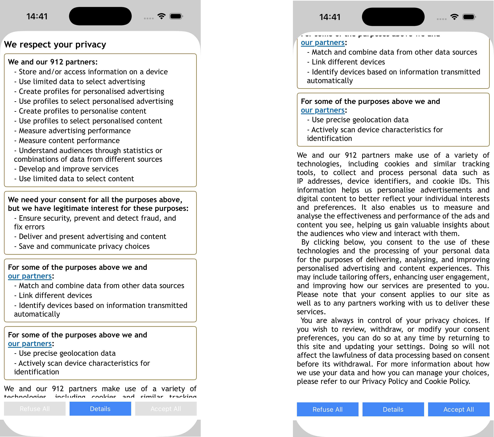
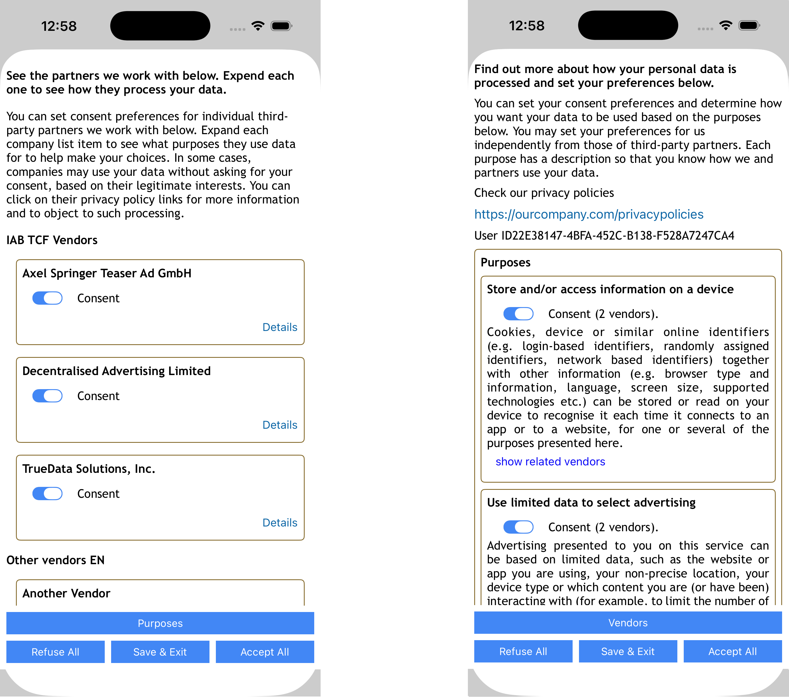
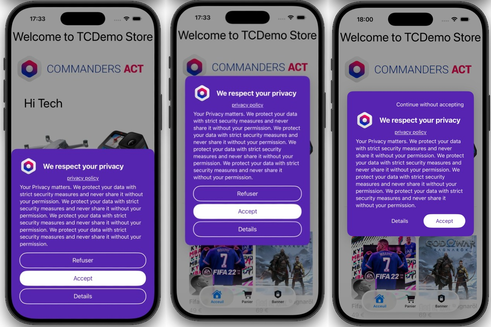

Consent's Implementation Guide
==============================

Last update : *04/08/2026*

Release version : *5.4.1*

## Table of Contents

- [Consent's Implementation Guide](#consents-implementation-guide)
- [Introduction](#introduction)
- [Related Documentation](#related-documentation)
- [Configure TCConsent](#configure-tcconsent)
  - [Choose your Modules Configuration](#choose-your-modules-configuration)
  - [Choose Consent flavour](#choose-consent-flavour)
  - [Choose UI Components Configuration](#choose-ui-components-configuration)
- [Technical Setup](#technical-setup)
  - [Minimum Requirements](#minimum-requirements)
  - [Initialisation](#initialisation)
- [Saving consent](#saving-consent)
  - [With our Privacy Center](#with-our-privacy-center)
  - [Manually displayed consent](#manually-displayed-consent)
  - [AcceptAll / RefuseAll](#acceptall-refuseall)
  - [Forwarding consent to Server-Side (external consent only)](#forwarding-consent-to-server-side-external-consent-only)
  - [Testing your integration](#testing-your-integration)
- [Consent Banner Setup](#consent-banner-setup)
  - [Configuration](#configuration)
  - [Usage](#usage)
  - [Options](#options)
  - [Design and colours](#design-and-colours)
  - [Button actions](#button-actions)
- [Privacy Center Setup](#privacy-center-setup)
  - [Launching the Privacy Center](#launching-the-privacy-center)
  - [Customisation](#customisation)
  - [Loading a specific screen directly](#loading-a-specific-screen-directly)
- [Reacting to consent](#reacting-to-consent)
- [Retaining consent](#retaining-consent)
  - [Using your own consent ID](#using-your-own-consent-id)
  - [Displaying the consent ID to the user](#displaying-the-consent-id-to-the-user)
  - [Consent validity duration](#consent-validity-duration)
  - [Resetting consent](#resetting-consent)
  - [Consent version](#consent-version)
  - [Displaying consent](#displaying-consent)
- [Privacy statistics](#privacy-statistics)
  - [Stop privacy statistics tracking](#stop-privacy-statistics-tracking)
- [Google Consent Mode (Firebase)](#google-consent-mode-firebase)
  - [Debugging Google Consent Mode](#debugging-google-consent-mode)
- [Forwarding consent to webViews](#forwarding-consent-to-webviews)
- [Consent internal API](#consent-internal-api)
- [Quick Reference — Function Recap](#quick-reference-function-recap)
- [TCDemo](#tcdemo)
- [Support and contacts](#support-and-contacts)

Introduction
============

The Consent module manages your users' consent: displaying a consent UI, saving consent on the device, checking its validity, and forwarding it to the ServerSide module.

This module can:

- Display a consent banner or Privacy Center.
- Save consent on the device and reload it on every launch.
- Check consent validity (default: 6 months).
- Send a hit to our servers to record the consent.
- Send hits to our servers for statistical purposes.
- Save the IAB TCF v2 consent string (when used with the TCIAB module).
- Forward consent to developers via callbacks if they need it outside of the module.
- If used alongside the ServerSide module:
    - Enable or disable the ServerSide module based on consent.
    - Automatically add consent categories to ServerSide hits.

Related Documentation
======================

| Document | When you need it |
|---|---|
| [Privacy JSON Documentation](../res/Privacy_JSON_Documentation.md) | Configuring `privacy.json` — categories, vendors, texts, banner content, Google Consent Mode mapping |
| [Building Your Own Privacy Center](../res/user_privacy_center.md) | You are **not** using `TCPrivacyCenterViewController` and are building a custom consent UI — required reading before calling `saveConsent` |
| [TCIAB documentation](../TCIAB/README.md) | IAB/TCF integration, AC String setup |
| [TCDemo (iOS)](https://github.com/CommandersAct/TCMobileDemo-V5/tree/master/iOS/) | Working sample app: ServerSide + Consent |

Configure TCConsent
===================

Choose your Modules Configuration
---------------------------------

- **With ServerSide** — modules: Core, Consent, ServerSide

    The module will automatically start or stop the ServerSide based on the saved or
    incoming consent. You don't need to manage this manually — just initialise the module
    and it handles the rest.

- **Standalone** — modules: Core, Consent (you manage your own solutions via callbacks)

    Without the ServerSide module, consent is still saved and callbacks still fire — but
    you are responsible for enabling or disabling your own third-party solutions based on
    what comes back in `consentUpdated`.

Choose Consent flavour
-----------------------

- **Non-IAB — modules: Core, Consent**

    Consent is collected and saved against your own custom categories and vendors as defined in privacy.json or passed to saveConsent: function.

- **IAB — modules: Core, Consent, TCIAB**

    [IAB (Interactive Advertising Bureau)](https://iabeurope.eu/) defines the Transparency and Consent Framework (TCF), the industry standard for collecting and communicating user consent for digital advertising. 
    When the TCIAB module is linked, consent is collected and saved as a TCF-compliant consent string in addition to the standard format. 
    The Privacy Center gains an IAB-compliant first layer, and the category and vendor screen includes all the IAB categories and defined Vendors — alongside your own custom categories and vendors, which are still displayed. See the [TCIAB documentation for details](../TCIAB/README.md).

- **IAB + AC String — modules: Core, Consent, TCIAB (AC String enabled in code)**

    [Google AC String](https://support.google.com/admanager/answer/9681920) is a complementary consent signal used by Google's ad technology providers, on top of the IAB TCF string. It is enabled in code by calling useAcString(true) before initialisation and requires a google-atp-list.json file and a list of Google vendors in privacy.json. See the [TCIAB documentation for details](../TCIAB/README.md).

Choose UI Components Configuration
----------------------------------

Before choosing your components, it helps to understand the layers of a consent flow, and our UI Components:

#### Consent layers

- **First layer** — The first screen a user sees. Typically a banner or modal where they can accept consent in one tap. The Consent Banner is a non-IAB first layer option; the Privacy Center can also act as a first layer when using IAB.

- **Second layer** — The detailed screen reached via a "Details" or "Manage" action, where users make granular choices per category and vendor. The Privacy Center always provides this layer.

> [!WARNING] IAB compliance:
> When using the IAB module, both the first layer and second layer must meet IAB specifications and be validated by IAB.

#### UI Components

#### Privacy Center

`TCPrivacyCenterViewController` is the full consent management UI where users toggle individual categories and vendors. Its behaviour adapts automatically based on whether the TCIAB module is linked — no code change needed.

| | With TCIAB | Without TCIAB |
|---|---|---|
| Opens to | IAB-compliant first layer, then category/vendor screen on Detail | Category/vendor screen directly |
| Vendors shown | Custom + IAB vendors | Custom vendors only |

> Linking or removing TCIAB is sufficient to switch modes.

For setup and launch options, see [Privacy Center Setup](#privacy-center-setup) below.

#### Consent Banner *(non-IAB only)*

`showBanner()` displays a lightweight first-layer banner. From its Details button, you can open the Privacy Center or any custom screen of your own. Not suitable for IAB setups at this time.

> [!NOTE]
> If you are using the TCIAB module, the Privacy Center already handles the first layer automatically — you do not need to call `showBanner()`.

For setup and display options, see [Consent Banner Setup](#consent-banner-setup) below.

> [!IMPORTANT]
> If you're unsure which setup to use, contact your account manager.

###  UI Components Configuration Options

- **With TCIAB (IAB)** - Both layers must meet IAB requirements. Options:

    - Use the Privacy Center for both layers (recommended)
    - Build your own first layer → bind to `TCConsent` → Privacy Center handles the second layer. See [Loading a specific screen directly](#loading-a-specific-screen-directly).

- **Without TCIAB (non-IAB)**  - no IAB constraints. Any combination works:

    - Our Consent Banner or your own banner as a first layer
    - Our Privacy Center or your own custom screen as a second layer

  *Privacy Center first layer (IAB):*

  

  *Privacy Center second layer (IAB & non-IAB):* with vendor screen on the left, categories on the right
  
  

  *Consent Banner (non-IAB first layer):*
  
  

Technical Setup
===============

> [!IMPORTANT]
> If you are using our UI (Banner and/or Privacy Center), you must include an offline copy of `privacy.json` in your project. This prevents issues for users with no or poor internet. If you are also using IAB, include `vendor-list.json` and the relevant `purposes-xx.json` translation file.

Documentation for `privacy.json` is available here: [Privacy JSON Documentation](../res/Privacy_JSON_Documentation.md)

> [!IMPORTANT]
> If you are using your own Privacy Center instead of ours, read the [Building Your Own Privacy Center](../res/user_privacy_center.md) guide first — it documents every function you need to call from your UI.

Minimum Requirements
--------------------

Minimum iOS version: 13.0

Initialisation
--------------

**With our UI components (Privacy Center and/or Banner, `privacy.json` required):**

in swift:

```swift
TCMobileConsent.sharedInstance().setSiteID(siteID, andPrivacyID: privacyID)
```

in objective-c:

```objc
[[TCMobileConsent sharedInstance] setSiteID: siteID andPrivacyID: privacyID];
```

**Without our UI components (custom privacy center):**

in swift:

```swift
TCMobileConsent.sharedInstance().customPCMSetSiteID(siteID, andPrivacyID: privacyID)
```

in objective-c:

```objc
[[TCMobileConsent sharedInstance] customPCMSetSiteID: siteID andPrivacyID: privacyID];
```

At init, the module checks saved consent and puts the ServerSide on hold if nothing is found. Once consent is given or loaded, the ServerSide is started or stopped accordingly.

> [!IMPORTANT]
> Register your callbacks **before** calling init. The module checks consent at startup and fires callbacks immediately.

If your configuration files are stored in a bundle other than the main one, call this **before** any access to `[TCMobileConsent sharedInstance]`:

in swift:

```swift
TCConfigurationFileFactory.sharedInstance().setBundle(myBundle, forConfiguration: "vendorlist")
```

in objective-c:

```objc
[[TCConfigurationFileFactory sharedInstance] setBundle: myBundle forConfiguration: @"vendorlist"];
```

Saving consent
==============

With our Privacy Center
-----------------------

Nothing to do — the Privacy Center propagates consent to all systems automatically.

Keep your custom category IDs between 1 and 999 in your `privacy.json`.

Manually displayed consent
--------------------------

> [!INFO]
> The `saveConsent*` methods cannot be used when using IAB. IAB compliance requires that consent be collected through a validated UI — the SDK cannot generate a TCF-compliant consent string from an interface it does not control. In IAB mode, use `acceptAllConsent()` / `refuseAllConsent()` for all-or-nothing consent, or our UI components for per-category and per-vendor granularity.
>
> If you need to collect consent manually through your own UI, the `saveConsent*` methods remain available in the **nonIAB configuration**.

If you build your own consent UI, once the user validates consent, pass it to the module:

in swift:

```swift
let consent = ["PRIVACY_CAT_1" : "1", "PRIVACY_CAT_2" : "0", "PRIVACY_CAT_3" : "1", "PRIVACY_VEN_61" : "1"]
TCMobileConsent.sharedInstance().save(consent, from: ETCConsentSource.Popup, withPrivacyAction: ETCConsentAction.Save)
```

in objective-c:

```objc
NSMutableDictionary *consent = [[NSMutableDictionary alloc] init];
[consent setObject: @"1" forKey: @"PRIVACY_CAT_1"];
[consent setObject: @"0" forKey: @"PRIVACY_CAT_2"];
[consent setObject: @"1" forKey: @"PRIVACY_CAT_3"];
[consent setObject: @"1" forKey: @"PRIVACY_VEN_61"];
[[TCMobileConsent sharedInstance] saveConsent: consent fromConsentSource: Popup withPrivacyAction: Save];
```

Prefix category IDs with `PRIVACY_CAT_` and vendor IDs with `PRIVACY_VEN_`. Values:

- `1` — accepted
- `2` — mandatory (cannot be refused)
- `0` — refused

Sources: `Popup` or `PrivacyCenter`

- `Popup` — the first-layer banner (e.g. your custom consent banner).
- `PrivacyCenter` — the second-layer privacy center screen.

Actions: `AcceptAll`, `RefuseAll`, `Save`

These correspond to the button the user tapped in your UI. When passing `AcceptAll` or `RefuseAll`, the SDK uses the action as the source of truth for intent and handles the consent state accordingly — you do not need to manually ensure every category in the dictionary matches.

AcceptAll / RefuseAll
---------------------

> [!WARNING]
> These methods only work if you are using our UI and have `privacy.json` in your project.

> [!NOTE]
> In the IAB variant, `acceptAllConsent()` and `refuseAllConsent()` are the only supported programmatic consent methods. For manual per-category or per-vendor consent in IAB mode, you must use our Privacy Center.

For clients displaying a custom first screen before our interface, with a way to accept or refuse all consent directly:

in swift:

```swift
TCMobileConsent.sharedInstance().acceptAllConsent()
TCMobileConsent.sharedInstance().refuseAllConsent()
```

in objective-c:

```objc
[[TCMobileConsent sharedInstance] acceptAllConsent];
[[TCMobileConsent sharedInstance] refuseAllConsent];
```

Forwarding consent to Server-Side (external consent only)
---------------------------------------------------------

Only needed if you use ServerSide with your own consent implementation external to our platform. Otherwise everything is handled automatically.

in swift:

```swift
let ext = ["key01" : "true", "key02" : "1", "312" : "0"]
TCUser.sharedInstance().setExternalConsent(ext)
```

in objective-c:

```objc
NSMutableDictionary *ext = [[NSMutableDictionary alloc] init];
[ext setValue: @"true" forKey: @"key01"];
[ext setValue: @"1" forKey: @"key02"];
[ext setValue: @"0" forKey: @"312"];
[[TCUser sharedInstance] setExternalConsent: ext];
```

Since it's external, and we don't really know how it's working, you can pass any string/string and we'll forward it as is.

Testing your integration
------------------------

Make sure logging is set to verbose (`TCDebug.setLogLevel(.verbose)`).

After consent is accepted or refused — whether via `acceptAllConsent()`, `refuseAllConsent()`, a manual `saveConsent` call, or a button press in the Privacy Center or Banner — you should see the following in your Xcode console:

```
CommandersAct: sending: https://privacy.trustcommander.net/privacy-consent/?tc_firsttime=1
CommandersAct: with POST data:
CommandersAct: {"privacyBeacon":{"id_privacy":3,"site":XXXX,"version":"XX","do_not_track":false,"privacy_action":"1","optin_categories":"1,2,3,...
```

If you see this, consent was saved successfully on the device and forwarded to our servers.

If not, check that logging is enabled and that one of the save methods above was actually called.

Consent Banner Setup
====================

> [!NOTE]
> The Consent Banner (`showBanner()`) is non-IAB. If you are using the TCIAB module, the Privacy Center already handles the first layer automatically — you do not need to call `showBanner()`.

The Consent Banner is a lightweight UI component to quickly collect consent before optionally opening the full Privacy Center.

Configuration
-------------

The banner can be displayed in two ways:

- **Bottom sheet** (`TCBannerType.bottom`) — slides up from the bottom of the screen as an overlay
- **Full screen** (`TCBannerType.fullScreen`) — displayed as a centered modal card

Textual and visual elements are defined in `privacy.json` under `"texts" -> "banner"` and are mandatory. Refer to the [privacy.json documentation](../res/Privacy_JSON_Documentation.md) for full details.

> [!NOTE]
> Both support a compact layout mode (`compactLayout: true` in `TCBannerOptions`) which reduces the visual weight of the banner. Only enable it when you are confident it meets your local regulations — buttons retain the same size and font, but the reduced visual prominence of the refuse option may not be sufficient in all jurisdictions.


*Left: full screen — Centre: bottom sheet — Right: compact layout*

Usage
-----

```swift
TCMobileConsent.sharedInstance().showBanner(
    type: .bottom,
    options: TCBannerOptions(),
    theme: nil,
    onDetails: {
        // Open the Privacy Center or your own screen here
    }
)
```

Parameters:

- `type` — banner display mode: `.bottom` for a bottom sheet or `.fullScreen` for a modal card
- `options` — layout and behaviour options (see [Options](#options) below); defaults to `TCBannerOptions()` if omitted
- `theme` — programmatic colour overrides (see [Design and colours](#design-and-colours) below); defaults to `nil` if omitted, in which case colours fall back to your asset catalogue / system colours
- `onDetails` — callback triggered when the user taps the details button

Options
-------

All options are set through `TCBannerOptions` and have safe defaults, so you only need to specify what you want to override:

```swift
TCBannerOptions(
    dimAmount: 0.4,
    isDismissible: false,
    iconName: "my_app_icon",
    iconSize: 20,
    buttonsAlignment: .horizontal,
    buttonsOrder: [.refuse, .details, .accept],
    compactLayout: false
)
```

| Option | Description | Default | Notes |
|--------|-------------|---------|-------|
| `dimAmount` | Background dim level behind the banner | `0.4` | `0` = transparent, `1` = fully black |
| `isDismissible` | Allow dismissal by tapping outside the banner | `false` | ⚠️ No consent is collected when dismissed this way |
| `iconName` | Name of the image asset displayed before the title | `nil` | Must exist in your app's asset catalogue |
| `iconSize` | Size (pt) of the icon displayed before the title | `20` | See [Icon](#icon) below |
| `buttonsAlignment` | Button layout direction: `.horizontal` or `.vertical` | `.horizontal` | Ignored when `compactLayout` is `true` |
| `buttonsOrder` | Display order of the three buttons | `[.refuse, .details, .accept]` | Ignored when `compactLayout` is `true` |
| `compactLayout` | Use the compact button layout | `false` | See note above |

Design and colours
------------------

Colours can be set two ways: via named colours in your app's asset catalogue, or programmatically via `TCBannerTheme`. The asset catalogue always takes priority when present; `TCBannerTheme` only applies where no matching named colour exists. If neither is set, the SDK falls back to system colours.

### Asset catalogue (named colours)

Define the following named colours in your app's asset catalogue:

- `TCBannerBackground` — main background colour of the banner.
- `TCBannerTextColor` — main text colour of the banner.

Dark mode is supported via named colours in your asset catalogue.

### Programmatic (`TCBannerTheme`)

For per-call control (e.g. a theme that isn't tied to your app's asset catalogue, or that changes at runtime), pass a `TCBannerTheme` to `showBanner()`. A `TCBannerTheme` holds two `TCBannerColours` — one for Light Mode, one for Dark Mode:

```swift
TCMobileConsent.sharedInstance().showBanner(
    type: .bottom,
    theme: TCBannerTheme(
        lightColours: TCBannerColours(
            background: UIColor,
            textColor: UIColor
        ),
        darkColours: TCBannerColours(
            background: UIColor,
            textColor: UIColor
        )
    ),
    onDetails: {
        // Open the Privacy Center or your own screen here
    }
)
```

Colour resolution priority (highest to lowest):

1. Named colour in asset catalogue (`TCBannerBackground` / `TCBannerTextColor`) — supports Dark/Light mode (recommended)
2. `TCBannerTheme` value passed to `showBanner()`, if set
3. System default (`secondarySystemBackground` / `label`)

Button actions
--------------

- **Accept** — calls `TCMobileConsent.sharedInstance().acceptAllConsent()`
- **Refuse** — calls `TCMobileConsent.sharedInstance().refuseAllConsent()`
- **Details** — triggers the `onDetails` callback you pass to `showBanner()`; open the Privacy Center or your own screen here

Privacy statistics are collected automatically on banner display and on each button tap.

Privacy Center Setup
====================

The Privacy Center (`TCPrivacyCenterViewController`) is the full consent management screen where users toggle individual categories and vendors.

It is driven by `privacy.json`, which describes the interfaces built natively inside the application. 
An offline copy is mandatory; an additional copy can be hosted on our CDN for remote updates — the module checks for updates automatically. Your account consultant will provide the `privacy.json` for your project.
Please check Privacy Json Documentation for more details on how to set every text or option of your Privacy Center.


**IAB and non-IAB launching**

As mentionned in the Privacy Center's behaviour on launch depends on whether the [TCIAB](../TCIAB/README.md) module is linked. 

- **Without TCIAB** — the Privacy Center opens directly to the category and vendor management screen, showing only your custom categories and vendors.

- **With TCIAB** — the Privacy Center first shows an IAB-compliant screen (the TCF first layer). The user must scroll through it before the action buttons become active. Tapping Detail opens the full category and vendor screen, which now includes IAB purposes, special purposes, features, special features, and IAB-registered vendors alongside your custom ones.

> [!NOTE]
> No code change is needed between the two modes — linking or removing the TCIAB module is sufficient.

> [!NOTE] To update the file remotely without a new app release, ask your Commanders Act consultant to push a new version to our CDN. The TCConsent always uses the file with the higher version number (from information → version), whether that is the bundled copy or the CDN one. The older version is ignored. 

Launching the Privacy Center
----------------------------

in swift:

```swift
let PCM = TCPrivacyCenterViewController()
self.navigationController?.pushViewController(PCM, animated: true)
```

in objective-c:

```objc
TCPrivacyCenterViewController *PCM = [[TCPrivacyCenterViewController alloc] init];
[self.navigationController pushViewController: PCM animated: YES];
```

Customisation
-------------

Change the default switch state to off:

in swift:

```swift
TCMobileConsent.sharedInstance().switchDefaultState = false
```

in objective-c:

```objc
[TCMobileConsent sharedInstance].switchDefaultState = NO;
```

Loading a specific screen directly
-----------------------------------

By default, when using TCIAB, launching the Privacy Center shows the IAB first layer. If you have built your own first-layer screen and want to skip straight to the second layer, use the following:

**Purpose screen:**

in swift:

```swift
let PCM = TCPrivacyCenterViewController()
PCM.startWithPurposeScreen()
self.navigationController?.pushViewController(PCM, animated: false)
```

in objective-c:

```objc
TCPrivacyCenterViewController *PCM = [[TCPrivacyCenterViewController alloc] init];
[PCM startWithPurposeScreen];
[self.navigationController pushViewController: PCM animated: NO];
```

**Vendor screen:**

in swift:

```swift
PCM.startWithVendorScreen()
```

in objective-c:

```objc
[PCM startWithVendorScreen];
```

Reacting to consent
===================

If you need to react to the user giving consent, or to consent being loaded at startup, implement `TCPrivacyCallbacks`.

> [!WARNING]
> Register your callbacks **before** initialising the Consent module. The module checks consent at init and fires callbacks immediately.

**`consentUpdated: (NSDictionary *) consent`**

Called when consent is loaded at startup, given inside the Privacy Center, or manually passed to the SDK. The dictionary contains `PRIVACY_CAT_n` and `PRIVACY_VEN_n` keys with `"0"` or `"1"` values. May be empty if nothing was consented to.

**`consentOutdated`**

Called after 6 months without any change in user consent. Use this to force re-displaying the consent screen, similar to first launch.

**`consentCategoryChanged`**

Called when a category is added, removed, or its ID changes in the configuration. Re-display the Privacy Center when this fires.

**`significantChangesInPrivacy`**

Created for IAB. Only fires when `"significantChanges"` is set in `privacy.json`. Not automatic.

You can also listen to ServerSide start/stop events via `kTCNotification_EnablingTheServerSide` and `kTCNotification_StoppingTheServerSide` notifications on NSNotificationCenter default center.

Retaining consent
=================

Consent is saved to our servers automatically. The identifier used by default is TCUser.consentID

If you need to prove consent or reset saved information, create a dedicated screen in your app for this purpose.

This ID is important — it is the key used to retrieve consent records when proof is required.

Using your own consent ID
-------------------------

in swift:

```swift
TCUser.sharedInstance().consentID = "myConsentID"
```

in objective-c:

```objc
[TCUser sharedInstance].consentID = @"myConsentID";
```

Displaying the consent ID to the user
--------------------------------------

You might want to be able to display to your end user the ID used to save the consent. You can simply get it like this:

in swift:

```swift
TCUser.sharedInstance().consentID
```

in objective-c:

```objc
[TCUser sharedInstance].consentID
```

Consent validity duration
-------------------------

Default validity is 6 months. To change it via `privacy.json`, add the following inside the `"information"` block:

```json
"consentDurationInMonths": "13"
```

To change it in code (call before init):

in swift:

```swift
TCMobileConsent.sharedInstance().consentDuration = 13
```

in objective-c:

```objc
[[TCMobileConsent sharedInstance] setConsentDuration: 13];
```

Resetting consent
-----------------

in swift:

```swift
TCMobileConsent.sharedInstance().resetSavedConsent()
```

in objective-c:

```objc
[[TCMobileConsent sharedInstance] resetSavedConsent];
```

This resets consent on the device every time it is called. Managing resets per app version must be done manually.

If you are using our Privacy Center, you can also use the `resetSave` field in `privacy.json`. Contact your consultant for details.

Consent version
---------------

To manually change the consent version (e.g. when using your own privacy center):

in swift:

```swift
TCMobileConsent.sharedInstance().consentVersion = "132"
```

in objective-c:

```objc
[[TCMobileConsent sharedInstance] setConsentVersion: @"132"];
```

Displaying consent
------------------

If you are familiar with Commanders Act Consent for web, you know that we actually record two things. The first thing is "displaying the consent form". This allows you to prove that a user has indeed been shown the consent screen even if he somehow left without accepting/refusing to give his consent.

Privacy statistics
==================

We have dashboards that provide detailed statistics on the choices your users make. Depending on your app's configuration choices, you may need to call some additional functions.

The four possible flows are:

- Custom banner/popup → our Privacy Center
- Custom banner/popup → custom Privacy Center
- Directly to our Privacy Center
- Custom Privacy Center only

> [!NOTE]
> If you are building your own Privacy Center, see [Building Your Own Privacy Center](../res/user_privacy_center.md) for the full list of statistic functions to call from your UI.

Whenever `saveConsent` is called, provide the full list of accepted and refused purposes and vendors.

Reference list of functions for our interfaces:

in swift:

```swift
TCMobileConsent.sharedInstance().refuseAllConsent()
TCMobileConsent.sharedInstance().acceptAllConsent()
TCMobileConsent.sharedInstance().statEnterPCToVendorScreen()
TCMobileConsent.sharedInstance().statViewPrivacyPoliciesFromBanner()
TCMobileConsent.sharedInstance().getNumberOfIABVendors() // IAB only
```

in objective-c:

```objc
[[TCMobileConsent sharedInstance] refuseAllConsent];
[[TCMobileConsent sharedInstance] acceptAllConsent];
[[TCMobileConsent sharedInstance] statEnterPCToVendorScreen];
[[TCMobileConsent sharedInstance] statViewPrivacyPoliciesFromBanner];
[[TCMobileConsent sharedInstance] getNumberOfIABVendors]; // IAB only
```

Stop privacy statistics tracking
---------------------------------

To disable privacy stat tracking, configure the following parameter:

```objc
[TCMobileConsent sharedInstance].do_not_track = value;
```

Google Consent Mode (Firebase)
==============================

[Google Consent Mode](https://developers.google.com/tag-platform/security/concepts/consent-mode) is a framework that lets you adjust how Google's Firebase Analytics behave based on the consent status of your users. When a user accepts or refuses consent, Google Consent Mode signals that to Firebase so they can adapt their data collection accordingly.

To use TCConsent to drive Google Consent Mode (GCM) in Firebase Analytics, add a `google_consent_mode` section to the root of your `privacy.json`:

```json
"google_consent_mode": {
    "use_consent_mode": true,
    "infer_ad_from_tcf": false,
    "category_mapping": {
        "ad_storage": 1,
        "ad_user_data": 2,
        "ad_personalization": 3,
        "analytics_storage": 4
    }
}
```

Please refer to the [privacy.json documentation](../res/Privacy_JSON_Documentation.md) for more information.

If you use IAB with `infer_ad_from_tcf: true` (IAB only), the three `ad_*` categories are mapped automatically from the TCF consent string and the `category_mapping` entries for them are ignored.

Implement the `firebaseConsentChanged` callback in your `TCPrivacyCallbacks` with this exact code:

```swift
import FirebaseCore

class MyPrivacyCallbacks: NSObject, TCPrivacyCallbacks {

    func firebaseConsentChanged(_ firebaseConsent: [String: NSNumber]!) {
        if let analytics_storage = firebaseConsent["analytics_storage"]?.boolValue {
            Analytics.setConsent([.analyticsStorage: analytics_storage ? .granted : .denied])
        }
        if let ad_storage = firebaseConsent["ad_storage"]?.boolValue {
            Analytics.setConsent([.adStorage: ad_storage ? .granted : .denied])
        }
        if let ad_user_data = firebaseConsent["ad_user_data"]?.boolValue {
            Analytics.setConsent([.adUserData: ad_user_data ? .granted : .denied])
        }
        if let ad_personalization = firebaseConsent["ad_personalization"]?.boolValue {
            Analytics.setConsent([.adPersonalization: ad_personalization ? .granted : .denied])
        }
    }
}
```

Register your callbacks and set the GCM developer ID **before** initialising TCConsent:

```swift
firebaseAnalytics.setDefaultEventParameters("developer_id", TC_GCM_DEVELOPER_ID)
TCMobileConsent.sharedInstance().callback = MyPrivacyCallbacks()
TCMobileConsent.sharedInstance().setSiteID(siteID, andPrivacyID: privacyID)
```

Debugging Google Consent Mode
------------------------------

TCConsent does not produce logs specific to Firebase consent mode — debugging should be done at the Firebase SDK level and through the Google console.

To verify your integration:

- **Enable DebugView on the Firebase SDK.** Refer to the [official Firebase documentation](https://developers.google.com/tag-platform/security/guides/app-consent?platform=ios) for how to do this on iOS.

- **Confirm consent is being saved by TCConsent first.** If the user has not accepted or refused yet, nothing will be forwarded. See the [Testing your integration](#testing-your-integration) section above to verify consent is recorded correctly before investigating the Firebase side.

- **Set a breakpoint inside `firebaseConsentChanged`** to confirm the callback fires and that the consent values it receives are what you expect.

Forwarding consent to webViews
==============================

To forward consent into a `WKWebView` so a web container inside it can use it, retrieve the consent as a JSON string and save it to the webView's local storage:

```objc
- (NSString *) getConsentAsJson;
```

> [!NOTE]
> This only provides the formatted JSON. You still need JS code inside the web container to consume it. Contact your consultant for that part.

Consent internal API
====================

`TCConsentAPI` provides utility methods to check consent state at any time:

```objc
/**
 * Should the privacy center be displayed?
 */
+ (BOOL) shouldDisplayPrivacyCenter

/**
 * Has consent already been given?
 */
+ (BOOL) isConsentAlreadyGiven;

/**
 * Epoch timestamp of last saved consent (0 if never).
 */
+ (unsigned long long) getLastTimeConsentWasSaved;

/**
 * Category / vendor checks.
 */
+ (BOOL) isCategoryAccepted: (int) catID;
+ (BOOL) isVendorAccepted: (int) venID;

/**
 * Lists of accepted items.
 */
+ (NSArray<NSString *> *) getAcceptedCategories;
+ (NSArray<NSString *> *) getAcceptedVendors;
+ (NSArray<NSString *> *) getAllAcceptedConsent;
+ (NSArray<NSString *> *) getAcceptedGoogleVendors;

/**
 * IAB-specific checks (IAB only — requires TCIAB module).
 */
+ (BOOL) isIABPurposeAccepted: (int) ID;
+ (BOOL) isIABVendorAccepted: (int) ID;
+ (BOOL) isIABSpecialFeatureAccepted: (int) ID;
```

Quick Reference — Function Recap
=================================

> [!NOTE]
> Many TCConsent functions are use-case dependent: it only applies to *your* configuration — whether you use **our UI** (Banner / Privacy Center) or a **Custom UI**, and whether you run **IAB** or **Non-IAB**. This section maps every function to the setup it belongs to, so you don't have to re-read the whole guide to know if a call applies to you.

| Function | UI ownership | Consent flavour | Notes |
|---|---|---|---|
| `setSiteID(_:andPrivacyID:)` | Our UI | Both | Standard init when using Banner and/or Privacy Center. `privacy.json` required. |
| `customPCMSetSiteID(_:andPrivacyID:)` | Custom UI | **Non-IAB only** | Init when you build your own consent screens entirely. |
| `save(_:from:withPrivacyAction:)` (`saveConsent`) | Custom UI only | **Non-IAB only** | ❌ Not usable in IAB mode — IAB requires consent collected through a validated UI. |
| `acceptAllConsent()` | Our UI or Custom UI | Both | This + `refuseAllConsent()` are the **only** programmatic IAB functions — usable from your own custom banner ONLY. |
| `refuseAllConsent()` | Our UI or Custom UI | Both | Same as above. |
| `stat*` (`statEnterPCToVendorScreen()`, `statViewPrivacyPoliciesFromBanner()`, etc.) | Custom UI only | Both | Only needed if you built your own screens — our rendered UI already calls these internally. See [Building Your Own Privacy Center](../res/user_privacy_center.md) for the full list. |
| `TCUser.sharedInstance().setExternalConsent(_:)` | Either | Both | Only relevant if ServerSide is driven by a consent system entirely external to Commanders Act. |
| `showBanner(type:options:theme:onDetails:)` | Our UI | **Non-IAB only** | ❌ Not supported for IAB — the Privacy Center handles the first layer instead. |
| `TCPrivacyCenterViewController()` (push) | Our UI | Both | Adapts automatically depending on whether TCIAB is linked — no code change needed between modes. |
| `TCUser.sharedInstance().consentID` (get/set) | Both | Both | Defaults to an internal ID; override to use your own (needed to retrieve consent proof later). |
| `privacy.json` | Our UI: required. | Both | Mandatory offline copy if using our UI (Banner and/or Privacy Center). |

TCDemo
======

[TCDemo_ServerSide_And_Consent](https://github.com/CommandersAct/TCMobileDemo-V5/tree/master/iOS/)

Support and contacts
====================


***
**Support**
*support@commandersact.com*

http://www.commandersact.com

Commanders Act | 25 rue de Tolbiac, 75013 Paris - France
***

This documentation was generated on 04/08/2026 16:06:11