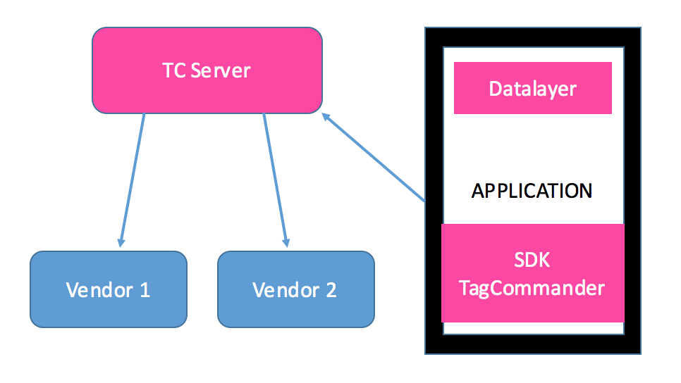

<html>
<body>

<h1 id="serversides-implementation-guide">ServerSide's Implementation Guide</h1>

<strong>iOS</strong>

Last update : <em>26/09/2023</em> 
Release version : <em>5.4.0</em>

<ul>
<li><a href="#serversides-implementation-guide">ServerSide's Implementation Guide</a></li>
<li><a href="#introduction">Introduction</a><ul>
<li><a href="#main-technical-specifications">Main Technical Specifications</a></li>
<li><a href="#event">Event</a></li>
<li><a href="#event-details">Event details</a></li>
<li><a href="#executing-an-event">Executing an event</a></li>
</ul>
</li>
<li><a href="#serversides-module-integration">ServerSide's module integration</a><ul>
<li><a href="#steps">Steps</a></li>
<li><a href="#integration-of-the-serversides-module">Integration of the ServerSide's Module</a></li>
<li><a href="#dependencies">Dependencies</a></li>
<li><a href="#compiler-flags">Compiler Flags</a></li>
<li><a href="#compatibility">Compatibility</a></li>
</ul>
</li>
<li><a href="#using-the-serversides-module">Using the ServerSide's module</a><ul>
<li><a href="#initialisation">Initialisation</a></li>
<li><a href="#executing-events">Executing events</a><ul>
<li><a href="#generic-properties">Generic properties :</a></li>
</ul>
</li>
<li><a href="#custom-events">Custom events</a></li>
<li><a href="#video-events">Video Events</a></li>
<li><a href="#consent">Consent</a></li>
<li><a href="#background-mode">Background Mode</a></li>
<li><a href="#deactivating-the-serversides-module">Deactivating the ServerSide's module</a></li>
<li><a href="#wait-for-user-agent">Wait for User-agent</a></li>
<li><a href="#getting-idfa">Getting IDFA</a></li>
<li><a href="#firebase-destination">Firebase Destination</a></li>
</ul>
</li>
<li><a href="#troubleshooting">Troubleshooting</a><ul>
<li><a href="#debugging">Debugging</a></li>
<li><a href="#testing">Testing</a></li>
<li><a href="#common-errors">Common errors</a></li>
<li><a href="#using-a-custom-process-pool">Using a custom process pool</a></li>
</ul>
</li>
<li><a href="#helpers">Helpers</a><ul>
<li><a href="#persisting-variables">Persisting variables</a></li>
</ul>
</li>
<li><a href="#swift">Swift</a></li>
<li><a href="#example-tcdemo">Example: TCDemo</a></li>
<li><a href="#migration-v4-to-v5">Migration v4 to v5</a><ul>
<li><a href="#why-a-new-version-of-the-sdk">Why a new version of the SDK</a></li>
<li><a href="#event-based">Event based</a></li>
<li><a href="#changes">Changes</a></li>
<li><a href="#example">Example</a></li>
</ul>
</li>
<li><a href="#support-and-contacts">Support and contacts</a></li>
</ul>

<h1 id="introduction">Introduction</h1>

Commanders Act enables marketers to easily add, edit, update, and deactivate tags on web pages, videos and mobile applications with little-to-no support from IT departments.

Instead of implementing several SDK's in the application, Commanders Act for mobile provides clients with a single module which sends data to our servers which then create and send information to your partners.

Thanks to remote configuration tools, it is also possible to modify the configuration without having to resubmit your application.

The purpose of this document is to explain how to add the ServerSide module into your application.

<h2 id="main-technical-specifications">Main Technical Specifications</h2>
<ul>
<li>Weight from 110 ko to 120 ko in your application depending on the iPhone model.</li>
<li>Fully threaded and asynchronous.</li>
<li>Offline mode (the hits are stored in the phone to be replayed when is convenient)</li>
<li>Very low CPU and memory usage.</li>
<li>Information collected and sent automatically while respecting GDPR.</li>
<li>Background mode, in the case you need to send data while the application is in background.</li>
</ul>
<h2 id="event">Event</h2>

An event represent something happening inside your application. For example, we have "add to cart" or "login" events.
Inside the library they are represented each by a specific class which in turn provide you with information needed for this event to be used by your solutions.

For example, we know that for a "view cart" event, you will have to provide a list of the items inside the cart for the event to be valid.
We also add "value" and "currency" that are generally used by solutions for this event that can be filled inside the class.

Your company alongside our consulting team will usually define step by step what events the want the application to send and what parameters are needed for the solutions which will in turn treat those events.

You should be provided with a document explaining all events you need to implement inside your application and when they should be sent.

The event and the information we gather independently will create a hit to our servers with a JSON payload.

<h2 id="event-details">Event details</h2>

All events and their payloads are detailed here: <a href="https://community.commandersact.com/platform-x/developers/tracking/events-reference">events-reference</a>

You will also find information about what you can add inside the TCUser which is sent with every hit.
Be aware that some data inside TCUser require consent from the user te be read and used.

You can also check this page to see the link between the event names and the SDK's Class names and all information inside the payload here:
<a href="https://community.commandersact.com/platform-x/developers/tracking/about-events/mobile-sdk-event-specificity">mobile-sdk-event-specificity</a>

<h2 id="executing-an-event">Executing an event</h2>

When you call the sendData method, a hit will be packaged and sent to Commanders Act's server.

<h1 id="serversides-module-integration">ServerSide's module integration</h1>
<h2 id="steps">Steps</h2>

You can divide the integration of CommandersAct ServerSide's module into the next few steps:

<ol>
<li>Adding the Core and ServerSide libraries to your Project.</li>
<li>Implementing the ServerSide module and adding events to your application.</li>
<li>Verify that all tags are being sent.</li>
</ol>
<h2 id="integration-of-the-serversides-module">Integration of the ServerSide's Module</h2>

<a href="../README.md">Please check the Developers Implementation Guide to chose the best way to implement this module in your project.</a>

<h2 id="dependencies">Dependencies</h2>

The ServerSide's module requires the following frameworks:

<ul>
<li>SystemConfiguration.framework</li>
<li>libz.dylib</li>
</ul>
<h2 id="compiler-flags">Compiler Flags</h2>

Please add the following option to your projects setting or xcconfig file

OTHER_LDFLAGS = $(inherited) -ObjC

<h2 id="compatibility">Compatibility</h2>
<ul>
<li>Architecture: armv7, arm64, i386 and x86_64, bitcode sections</li>
<li>iOS version: 9.0 minimum</li>
<li>Compiled with the ENABLE_BITCODE = YES option</li>
<li>Compiled with ARC enabled</li>
</ul>
<h1 id="using-the-serversides-module">Using the ServerSide's module</h1>
<h2 id="initialisation">Initialisation</h2>

It is recommended to initialise TCServerSide in your <code>AppDelegate's applicationdidFinishLaunchingWithOptions</code> so it will be operational as soon as possible.

You will need 2 things provided by our consulting team. A siteID which is representing the web platform in which you setup your destinations.
And a sourceKeyID which will represent the Android source inside your setup.

If you are using our Consent module, you can also change during this initialisation the default ServerSide behaviour while waiting for the user consent.
More information a bit later in this document.

A single line of code is required to properly initialize an instance of ServerSide, and you can add one more for better logging:

in objective-c :

<pre><code>//!\\ Important while integrating TCServerSide
[TCDebug setDebugLevel: TCLogLevel_Verbose];
ServerSide *serverSide = [[ServerSide alloc] initWithSiteID: siteID andSourceKey: sourceKey];
</code></pre>

in swift : 

<pre><code>//!\\ Important while integrating TCServerSide
TCDebug.setNotificationLog(true)
let serverSide = ServerSide.init(siteID: siteID, andSourceKey: sourceKey)
</code></pre>
<h2 id="executing-events">Executing events</h2>

Each time you are required to launch an event, simply instantiate the corresponding event, fill it with what your tagging plan suggest and execute it.

in objective-c : 

<pre><code>NSMutableArray *items = [[NSMutableArray alloc] init];
[items addObject: [[TCItem alloc] initWithItemId: @"iID1"
                                  withProduct: [[TCProduct alloc] initWithProductId: @"pID1" withName: @"pName1" withPrice: @1.5f]
                                  withQuantity: 1]];

[items addObject: [[TCItem alloc] initWithItemId: @"iID2"
                                  withProduct: [[TCProduct alloc] initWithProductId: @"pID2" withName: @"pName2" withPrice: [[NSDecimalNumber alloc] initWithFloat: 2.5f]]
                                withQuantity: 2]];

TCPurchaseEvent *event = [[TCPurchaseEvent alloc] initWithId: @"ID"
                                                  withRevenue: [[NSDecimalNumber alloc] initWithString: @"1.1"]
                                                  withValue: [[NSDecimalNumber alloc] initWithString: @"12.2"]
                                                  withCurrency: @"EUR"
                                                  withType: @"purchase"
                                                  withPaymentMethod: @"CreditCard"
                                                  withStatus: @"waiting"
                                                  withItems: items];

[serverSide execute: event];
</code></pre>

in swift : 

<pre><code>  let tc_item = TCItem.init(itemId: "iID1", with: TCProduct(productId: "pID1", withName: "pName1", withPrice: 1.5), withQuantity: 1)
  let tc_item_2 = TCItem.init(itemId: "iID2", with: TCProduct(productId: "pID2", withName: "pName2", withPrice: 2.5), withQuantity: 2)
  let items = [tc_item, tc_item_2];

  let event = TCPurchaseEvent(id: "ID", withRevenue: 1.1, withValue: 12.2, withCurrency: "EUR", withType: "purchase", withPaymentMethod: "CreditCard", withStatus: "waiting", withItems: items)
  serverSide?.execute(event)Customising Events
</code></pre>

Events are tailored for the most common solutions' needs. But you might need to add properties that are not specified in the event you are trying to send.

You can choose to edit your events by directly accessing the event object property, or you can choose to add new properties. Depending on your needs, you can use the following methods to achieve this.

<pre><code>/!\ - It is possible to access directly additionalProperties for wrapper purposes, but it's highly recommended to avoid doing so as it may break your event paylaod format. Only do it if you know exactly what you're doing.

- (void) addAdditionalProperty: (NSString *) key withStringValue: (NSString *) value;
- (void) addAdditionalProperty: (NSString *) key withDictValue: (NSDictionary *) json;
- (void) addAdditionalProperty: (NSString *) key withBoolValue: (BOOL) value;
- (void) addAdditionalProperty: (NSString *) key withNumberValue: (NSDecimalNumber *) value;
- (void) addAdditionalProperty: (NSString *) key withDigitStringValue: (NSString *) value; // value here is a DigitString that'll be parsed to a precised number
- (void) addAdditionalProperty: (TCDynamicStore *) store;
</code></pre>

Also, for accessing &amp; removing already added properties :

<pre><code>- (NSMutableDictionary *) getAdditionalProperties;
- (void) removeAdditionalProperty: (NSString *) key;
- (void) clearAdditionalProperties;
</code></pre>

Here for example this could be tracking some user going back to your configuration to open the consent interface. And you would want to know what was the consent before re-opening.
Of course this is a simple example only here to show the addAdditionalProperty method.

in objective-c : 

<pre><code>TCPageViewEvent *pageViewEvent = [[TCPageViewEvent alloc] initWithType: @"Consent"];
pageViewEvent.pageName = @"Configuration";
[pageViewEvent addAdditionalProperty: @"currentConsent" withStringValue: @"refused"];
</code></pre>

in swift : 

<pre><code>let pageViewEvent = TCPageViewEvent(type: "Consent")
pageViewEvent.pageName = @"Configuration";
pageViewEvent?.addAdditionalProperty("currentConsent", withBoolValue: "refused")
</code></pre>

If you want to customize the other fields in your events, you can directly edit properties on the coresponding singleton instance (except for TCLifecycle) or use custimisation methodes.

Please note that these are constant fields across the events, changes will be applied to all events at once.
Here's a list of the available editable fields :

<ul>
<li>[TCDevice sharedInstance]</li>
<li>[TCNetwork sharedInstance]</li>
<li>[TCUser sharedInstance]</li>
<li>[TCApp sharedInstance]</li>
<li>[TCLifecycle sharedInstance]</li>
<li>TCItem and TCProduct objects</li>
</ul>

For TCDevice's inner fields, Os &amp; Screen are accessible via :
in objective-c : 

<pre><code>[[TCDevice sharedInstance] getOsProperties]
[[TCDevice sharedInstance] getScreenProperties]
</code></pre>

in swift : 

<pre><code>TCDevice.sharedInstance().getOsProperties()
TCDevice.sharedInstance().getScreenProperties()
</code></pre>
<h4 id="generic-properties">Generic properties :</h4>

Some properties require access to additional protected resources, bluetooth for example.
We have default values to always have a valid datalayer for those. But if you need the real value for your partners, you will need to ask for permissions if needed and fill the value by yourself. They are set as public so it should be easy for you.

<table>
<thead>
<tr>
<th>Class.propertyName</th>
<th>Value type</th>
<th>default value</th>
</tr>
</thead>
<tbody>
<tr>
<td>TCNetwork.bluetooth</td>
<td>Boolean</td>
<td>false</td>
</tr>
</tbody>
</table>
<h2 id="custom-events">Custom events</h2>

In some case, the classic events might not suit your needs, in this case you can build complete custom events.
It is important to name them properly as this will be the base of forwarding them to your destinations.

in objective-c :

<pre><code>TCCustomEvent *event = [[TCCustomEvent alloc] initWithName: @"eventName"];
[event addAdditionalParameter: @"myParam" withValue: @"myValue"];
[TCS execute: event];
</code></pre>

in swift :

<pre><code>let event = TCCustomEvent(name: "eventName")
event?.addAdditionalProperty("myParam", "myValue")
tc?.execute(event)
</code></pre>
<h2 id="video-events">Video Events</h2>

There are 4 main video events classes : TCVideoSettingEvent, TCVideoPlaybackEvent, TCVideoContentEvent &amp; TCVideoAdEvent. 

Every Video event will have multiple modes, choose the  right mode for each event you're sending. 

You'll have to manage your video_session_id across the video events you're sending. 

if you have multiple videos, you'll need to set multiple video_session_id for every one of them. 

example : 

in objective-c : 

<pre><code>TCVideoAdEvent *event = [[TCVideoAdEvent alloc] initWithMode: video_ad_start andSessionId: @"0000-0000-0001"];// first video
TCVideoAdEvent *event_2 = [[TCVideoAdEvent alloc] initWithMode: video_ad_playing andSessionId: @"0000-0000-0001"];// another event for the first video!

[serverSide execute: event];
[serverSide execute: event_2];

TCVideoAdEvent *event_3 = [[TCVideoAdEvent alloc] initWithMode: video_ad_start andSessionId: @"0000-0000-0002"];// second video
TCVideoAdEvent *event_4 = [[TCVideoAdEvent alloc] initWithMode: video_ad_playing andSessionId: @"0000-0000-0002"];// another event for the second video!

[serverSide execute: event_3];
[serverSide execute: event_4];
</code></pre>

in swift : 

<pre><code>let event = TCVideoAdEvent(wIthMode: video_ad_start, andSessionId: "0000-0000-0001") // first video
let event_2 = TCVideoAdEvent(wIthMode: video_ad_playing, andSessionId: "0000-0000-0001") // another event for the first video!

serverSide?.execute(event)
serverSide?.execute(event_2)

let event_3 = TCVideoAdEvent(wIthMode: video_ad_start, andSessionId: "0000-0000-0002") // second video
let event_4 = TCVideoAdEvent(wIthMode: video_ad_playing, andSessionId: "0000-0000-0002") // another event for the second video !
serverSide?.execute(event_3)
serverSide?.execute(event_4)
</code></pre>
<h2 id="consent">Consent</h2>

To manage the privacy of the user's data you can use our Consent product, another product or nothing at all.

By default, the ServerSide module will try to see if you have added our Privacy module. If so, it will put itself into a waiting for consent mode.
In this mode, it will record all hits but wait to consent information to either send everything or delete all waiting hits.

If you don't use our Consent module, the ServerSide's will be enabled by default.

If you want to change this behaviour, we added a way to initialise the ServerSide module with additional information about the behaviour.
We have 3 behaviours:

<pre><code>- PB_DEFAULT_BEHAVIOUR which is the one described just before
- PB_ALWAYS_ENABLED which forces the ServerSide's module to always send information. This is used when you have tags that don't require consent.
- PB_DISABLED_BY_DEFAULT which forces the ServerSide's module to disabled. It won't record hits before consent is given and you won't have any up by default time when using tagging the app loading screens. This is used when you're not using our Consent module.
</code></pre>

Consent will then be forwarded inside the TCUser. For more information, please check documentation about the <a href="../TCConsent/README.md">Consent module</a>. 

To initialise the ServerSide with another behaviour, please call the following function:

in objective-c : 

<pre><code>ServerSide *tc = [[ServerSide alloc] initWithSiteID: andSourceKey: sourceKey siteID andDefaultBehaviour: PB_ALWAYS_ENABLED];
</code></pre>

in swift : 

<pre><code>let tc = ServerSide.init(siteID: siteID, andSourceKey: sourceKey, andDefaultBehaviour: PB_DEFAULT_BEHAVIOUR)
</code></pre>
<h2 id="background-mode">Background Mode</h2>

While the application is goind to background, the ServerSide's module sends all data that was already queued then stops. This is in order to preserve battery life and not use carrier data when not required.

But some applications need to be able to continue sending data because they have real background activities. For example listening to music.

For those cases, we added a way to bypass the way the ServerSide's module usually react to background. Please call:

in objective-c :

<pre><code>[tc enableRunningInBackground];
</code></pre>

in swift :

<pre><code>tc?.enableRunningInBackground()
</code></pre>

One drawback is that we're not able to ascertain when the application will really be killed. In normal mode, we're saving all hits not sent when going in the background, which is not possible here anymore. To be sure to not loose any hits in background mode, we will save much more often the offline hits.

Please assure that your application has background modes enabled to use this feature.

<h2 id="deactivating-the-serversides-module">Deactivating the ServerSide's module</h2>

If you want to show a privacy message to your users allowing them to stop the tracking, you might want to use the following function to stop it if they refuse to be tracked.

in objective-c : 

<pre><code>[TCS disableServerSide];
</code></pre>

in swift : 

<pre><code>tc.disableServerSide();
</code></pre>

What this function does is stopping all systems in the ServerSide's module that update automatically or listen to notifications like background or internet reachability. This will also ignore all calls to the ServerSide's module by your application so that nothing is treated anymore and you don't have to protect those calls manually.

in objective-c : 

<pre><code>[TCS enableServerSide];
</code></pre>

in swift : 

<pre><code>tc. enableServerSide();
</code></pre>

In the case you need to re-enable it after disabling it the first time, you can use this function.

<h2 id="wait-for-user-agent">Wait for User-agent</h2>

As Apple removed the old class which allowed us to get the user-agent synchroneously, we sometimes have a bit of delay before the user-agent is available. And for unknown reasons, this delay is sometimes more than a minute on real devices.

If it is important for your solution to have acces to the user-agent, please call the following method:

<pre><code>[TCS waitForUserAgent: YES];
</code></pre>

When the user-agent is ready, it will be added to all the hit waiting to be sent.

<h2 id="getting-idfa">Getting IDFA</h2>

For privacy reason, the server-side module can't read and use the IDFA automatically. We need to first be sure that your user have accepted the corresponding category inside the privacy.

Also, if you are using iOS 14 or later, you have to display the system pop-up firs.

Since we don't know the flow of your application, you'll have to call the popup when you are ready to. You can check some code example here: https://medium.com/@nish.bhasin/how-to-get-idfa-in-ios14-54f7ea02aa42

and in the "case .authorized:", and the user accepted the related privacy category you can call:

<pre><code>[ServerSideInstance addAdvertisingIDs];
</code></pre>

This method will check and add if possible the IDFA, the IDFV and the boolean "is ad tracking enabled".

<h2 id="firebase-destination">Firebase Destination</h2>

You'll need to correctly set up Firebase SDK first into your app, please refer to the official firebase documentation to do so.
Once you have your firebase SDK running and your <code>google-services.json</code> into your app bundle, you only need to pass the firebase instance into your ServerSide instance initialisation. 

<code>tc = ServerSide.init(siteID: siteID, andSourceKey: sourceKey, andFirebaseInstance: Analytics.self)</code>

Once done, every time you execute a TCEvent, it will be remapped and sent to google.

All of the TCEvents properties will be re-mapped into a Firebase event holding your executed TCEvent name.

For TCEcommerce events (TCAddToCartEvent, TCRemoveFromCartEvent ...etc), we use the following mapping :

<table>
<thead>
<tr>
<th>TCEvent Property</th>
<th>Firebase Property</th>
</tr>
</thead>
<tbody>
<tr>
<td>event.items[i].id</td>
<td>event.items[i].item_id</td>
</tr>
<tr>
<td>event.items[i].X</td>
<td>event.items[i].tc_item_X</td>
</tr>
<tr>
<td>event.items[i].product.name</td>
<td>event.items[i].item_name</td>
</tr>
<tr>
<td>event.items[i].product.X</td>
<td>event.items[i].tc_product_X</td>
</tr>
</tbody>
</table>

The predefined variables related to events (such as TCDevice and TCNetwork) aren't included in the Firebase event because they are already being gathered by Firebase SDK.

<h1 id="troubleshooting">Troubleshooting</h1>

The ServerSide also offers methods to help you with the Quality Assessment of the implementation.

<h2 id="debugging">Debugging</h2>

We recommend using TCLogLevel_Verbose while developing your application:

in objective-c : 

<pre><code>// Put it before the TagCommander initialization
#ifdef DEBUG
    [TCDebug setDebugLevel: TCLogLevel_Verbose];
    [TCDebug setNotificationLog: YES];
#end
</code></pre>

in swift : 

<pre><code>#if DEBUG
    TCDebug.setDebugLevel(TCLogLevel_Verbose)
    TCDebug.setNotificationLog(true)
#endif
</code></pre>
<ul>
<li>

The first line allows you to select the verbosity of TagCommander's logs.

<ul>
<li>Verbosity</li>
</ul>
<table>
<thead>
<tr>
<th>Constant Name</th>
<th>Verbosity</th>
</tr>
</thead>
<tbody>
<tr>
<td>TCLogLevel_Verbose</td>
<td>Print everything.</td>
</tr>
<tr>
<td>TCLogLevel_Debug</td>
<td>Most useful information for debugging.</td>
</tr>
<tr>
<td>TCLogLevel_Info</td>
<td>Basic information about TagCommander's state.</td>
</tr>
<tr>
<td>TCLogLevel_Warn</td>
<td>Warnings only.</td>
</tr>
<tr>
<td>TCLogLevel_Error</td>
<td>Errors only.</td>
</tr>
<tr>
<td>TCLogLevel_Assert</td>
<td>Asserts only.</td>
</tr>
<tr>
<td>TCLogLevel_None</td>
<td>No print at all.</td>
</tr>
</tbody>
</table>
</li>
<li>

The internal architecture is working with internal notifications. You can ask the Logger to display all the internal notifications with setNotificationLog: YES.

</li>
</ul>
<h2 id="testing">Testing</h2>

There are four ways to verify that the module executes the tags in your application:

<ul>
<li>By reading the debug messages in the console.</li>
<li>To check the interfaces inside the platform.</li>
<li>By going to your vendor's platform and check that the hits are displayed and that the data is correct. Please be aware that hits may not display immediately in the vendor account. This delay differs widely between vendors and may also vary for the type of hit under the same vendor.</li>
<li>You can also use a network monitor like Wireshark or Charles to check directly what is being sent on the wire to your vendors.</li>
</ul>
<h2 id="common-errors">Common errors</h2>

<blockquote>
<ul>
<li>Make sure you have the latest version.</li>
<li>Enable the debug logs if you have any doubt.</li>
<li>Check if TCServerSide is called when you think it should be. You should see it in the console logs or inside the monitoring interface.</li>
<li>Make sure a second time that you have the latest version. (this really is the most common issue)</li>
<li>Check all your IDs</li>
</ul>
</blockquote>
<h2 id="using-a-custom-process-pool">Using a custom process pool</h2>

You might have issue with cookies stored in webviews and want to use a custom-process pool.
If you encounter this issue, you need to pass your custom process pool like to TCDebug class:

<pre><code>+ (void) useCustomWKProcessPool: (BOOL);
</code></pre>

This tells the SDK to wait before getting the user-agent to prevent cookie issues. If you do need to user-agent, you will need to manually call the following method in TCCoreVariables:

<pre><code>- (void) initUserAgentWithProcessPool: (WKProcessPool *) pool;
</code></pre>
<h1 id="helpers">Helpers</h1>
<h2 id="persisting-variables">Persisting variables</h2>

ServerSide's module permits storing of variables that remain the same in the whole application, such as vendors ID, in a ServerSide's instance, instead of sending them each time you want to send data.

These variables will have a lower priority to the one given by the addData method but will persist for the whole run of the application.

in objective-c : 

<pre><code>[self.ServerSideInstance addPermanentData: @"#VENDOR_ID#" withValue: @"UE-556XXXXX-01"];

// They can also be removed if necessary.

[self.ServerSideInstance removePermanentData: @"#VENDOR_ID#"];
</code></pre>

in swift : 

<pre><code>ServerSideInstance?.addPermanentData("#VENDOR_ID#", withValue: "UE-556XXXXX-01")

// They can also be removed if necessary.

ServerSideInstance?.removePermanentData("#VENDOR_ID#")
</code></pre>
<h1 id="swift">Swift</h1>

If you want to use Swift as your main language, there is absolutely nothing special to do.
Compile with the latest versions and call our modules as usual.

<h1 id="example-tcdemo">Example: TCDemo</h1>

To check an example of how to use this module, please check:

<a href="https://github.com/CommandersAct/TCMobileDemo-V5/tree/master/iOS/ServerSideOnly">TCDemo_ServerSideOnly</a>

<h1 id="migration-v4-to-v5">Migration v4 to v5</h1>
<h2 id="why-a-new-version-of-the-sdk">Why a new version of the SDK</h2>

CommandersAct made a big move forward to bring all his products together in a whole new platform.

As the mobile counterpart of all products we needed to re-work our SDKs in the same manner and create more logical connections with the whole suit.

We have renamed some modules to this end. SDK is now named ServerSide as it is only used to send information to our platform.
And TCPrivacy has been renamed to Consent since it is the name of our product inside our suit. And it is used to gather consent.

<h2 id="event-based">Event based</h2>

The biggest change as a user of the mobile SDK will to the way you send information to our servers.

Before you would create a big blob of data, fill it with anything needed or not even needed and send this.
We would then filter on the server-side this data and try to fill the tags with relevant information.

But as you may know, the previous server-side wouldn't allow much possibilities other than transferring the data.
With the new server-side you can rework your data in our interfaces and have more control over the data used by your solutions.

With this new version you will have to send "events".

An Event is a logical entity used by your other solutions (also named destinations) in a form that they can treat directly.
If you are using Facebook Conversion, you know that you can send "purchase" events for example which will be treated by our server-side to fit exactly what is needed by Facebook in this case.
This allow to be more precise and thus have less testing on both sides to know if what you send is indeed correctly used by your solution.

All custom events are defined on our online documentation including all parameters needed, all possible and their required formats.
Of course while using the ServerSide module, you can also check directly each event classes.

The hard part should not be for developers but for consulting which should re-organise all information currently sent in events.

<h2 id="changes">Changes</h2>

Many classes have been renamed, hopefully you'll only need 2 or 3 of them in your implementation.

Most notably: (module.classname)

<pre><code>TCSDK/TagCommander -&gt; TCServerSide/ServerSide
TCPrivacy/TCMobilePrivacy -&gt; TCConsent/TCMobileConsent
TCPrivacy/TCPrivacyAPI -&gt; TCConsent/TCConsentAPI
TCPrivacy/TCPrivacyCenterViewController -&gt; TCConsent/TCPrivacyCenterViewController
TCPrivacy/TCIABPrivacyCenterViewController -&gt; TCConsent/TCPrivacyCenterViewController
</code></pre>

You don't need container ID anymore, all is on the same siteID. But you'll need a key specific to define the source.

You don't need to put any ServerSide instance in your Consent implementation anymore.

You might need to use the TCUser class to forward relevant information about your user.

<h2 id="example">Example</h2>

in objective-c : 

<pre><code>// Only sourceKey is new here, it's available on the platform and can be used to disable specific sources.
int TC_SITE_ID = 29; // defines this site account ID
NSString *sourceKey = @"NJtcKaoCYuZEFEzDSGZDxRgMBMUw==";

ServerSide *TCS = [[ServerSide alloc] initWithSiteID: siteID andSourceKey: @"sourceKey" andDefaultBehaviour: PB_DEFAULT_BEHAVIOUR];

// You can set in stone some information about your user and that will be sent with each events.
[TCUser sharedInstance].email = @"superUser@gmal.coum";

// Here an example of a purchase event with the item purchased.
TCProduct *product = [[TCProduct alloc] initWithProductId: @"pID1" withName: @"some product" withPrice: [[NSDecimalNumber alloc] initWithFloat: 1.5f]];
TCItem *item = [[TCItem alloc] initWithItemId: @"iID1" withProduct: product withQuantity: 1];
TCPurchaseEvent *event = [[TCPurchaseEvent alloc] initWithId: @"ID" withRevenue: [[NSDecimalNumber alloc] initWithFloat: 1.1f] withValue: [[NSDecimalNumber alloc] initWithString: @"12.2"] withCurrency: @"EUR" withType: @"purchase" withPaymentMethod: @"CreditCard" withStatus: @"waiting" withItems: @[item]];

[TCS execute: event];
</code></pre>

in swift : 

<pre><code>    // Only sourceKey is new here, it's available on the platform and can be used to disable specific sources.
    let TC_SITE_ID = Int32(29); // defines this site account ID
    let sourceKey = "NJtcKaoCYuZEFEzDSGZDxRgMBMUw==";

    let TCS = ServerSide.init(siteID: TC_SITE_ID, andSourceKey: sourceKey, andDefaultBehaviour: PB_DEFAULT_BEHAVIOUR)

    // You can set in stone some information about your user and that will be sent with each events.
    TCUser.sharedInstance().email = "superUser@gmal.coum";

    // Here an example of a purchase event with the item purchased.
    let tc_product = TCProduct(productId: "pID1", withName: "some product", withPrice: 1.5)
    let tc_item = TCItem(itemId: "iID1", with: tc_product, withQuantity: 1)

    let event = TCPurchaseEvent.init(id: "ID", withRevenue: 1.1, withValue: 12.2, withCurrency: "EUR", withType: "purchase", withPaymentMethod: "CreditCard", withStatus: "waiting", withItems: [tc_item])

    TCS?.execute(event)
</code></pre>

And that's it!

<h1 id="support-and-contacts">Support and contacts</h1>

<strong>Support</strong>
<em>support@commandersact.com</em>

http://www.commandersact.com

This documentation was generated on 26/09/2023 16:18:22

</body>
</html>