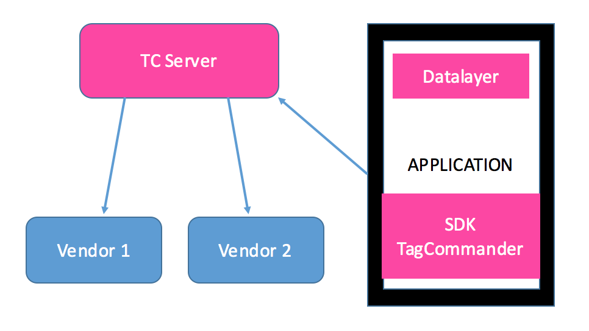
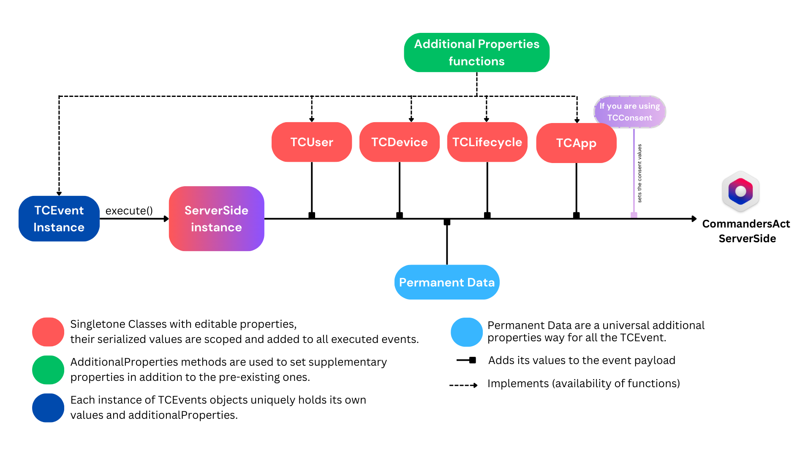

ServerSide's Implementation Guide
=================================

Last update : *28/07/2026*

Release version : *5.5.0*

## Table of Contents

- [ServerSide's Implementation Guide](#serversides-implementation-guide)
- [Introduction](#introduction)
- [Related Documentation](#related-documentation)
  - [Main Technical Specifications](#main-technical-specifications)
  - [Compatibility](#compatibility)
  - [Event](#event)
  - [Commanders Act's TCEvent Payload](#commanders-acts-tcevent-payload)
  - [Executing an event](#executing-an-event)
- [ServerSide module integration](#serverside-module-integration)
  - [Steps](#steps)
  - [Initialisation](#initialisation)
  - [Executing events](#executing-events)
  - [How to customise your payload](#how-to-customise-your-payload)
- [Using the ServerSide module](#using-the-serverside-module)
  - [Customising Events — Code Reference](#customising-events-code-reference)
  - [Generic properties](#generic-properties)
  - [Custom events](#custom-events)
  - [Video Events](#video-events)
  - [Consent](#consent)
  - [Background Mode](#background-mode)
  - [Deactivating the ServerSide module](#deactivating-the-serverside-module)
  - [Wait for User-agent](#wait-for-user-agent)
  - [Getting IDFA](#getting-idfa)
- [Firebase Destination](#firebase-destination)
  - [Supported Firebase Events](#supported-firebase-events)
- [Troubleshooting](#troubleshooting)
  - [Debugging](#debugging)
  - [Understanding the logs](#understanding-the-logs)
  - [Testing](#testing)
  - [Network monitor](#network-monitor)
  - [Common errors](#common-errors)
  - [Using a custom WKProcessPool](#using-a-custom-wkprocesspool)
- [Helpers](#helpers)
  - [Persisting variables](#persisting-variables)
- [Swift](#swift)
- [Example: TCDemo](#example-tcdemo)
- [Migration v4 to v5](#migration-v4-to-v5)
  - [Why a new version](#why-a-new-version)
  - [Event-based model](#event-based-model)
  - [Changes](#changes)
  - [Example](#example)
  - [Useful migration methods](#useful-migration-methods)
- [Support and contacts](#support-and-contacts)

Introduction
============

Commanders Act enables marketers to easily add, edit, update, and deactivate tags on web pages, videos, and mobile applications with little-to-no support from IT departments.

Instead of embedding multiple SDKs, Commanders Act for mobile provides a single module that sends data to our servers, which then create and forward information to your partners.

Remote configuration tools also make it possible to update your setup without resubmitting the application.

Related Documentation
======================

| Document | When you need it |
|---|---|
| [Events Reference](https://doc.commandersact.com/developers/tracking/events-reference) | Full list of events and payloads, with code examples |
| [Mobile SDK Event Specificity](https://community.commandersact.com/platform-x/developers/tracking/about-events/mobile-sdk-event-specificity) | Mapping between event names, SDK class names, and payload content |
| [Consent module](../TCConsent/README.md) | Managing user consent and its effect on the ServerSide module |
| [TCDemo (iOS)](https://github.com/CommandersAct/TCMobileDemo-V5/tree/master/iOS) | Working sample app: ServerSide + Consent |

Main Technical Specifications
-----------------------------

- Weight: 110–120 KB depending on the iPhone model.
- Fully threaded and asynchronous.
- Offline mode: hits are stored on device and replayed when a connection is available.
- Very low CPU and memory footprint.
- GDPR-compliant data collection.
- Background mode support for apps that need to send data while running in the background.

Compatibility
-------------

- Architectures: armv7, arm64, i386, x86_64
- Minimum iOS version: 13.0
- Compiled with ARC enabled

Event
-----

An event represents something happening inside your application — for example, "add to cart" or "login". Each event type is represented by a dedicated class that describes the data it requires.

For a "view cart" event, for instance, the class will expect a list of cart items, as well as optional fields like `value` and `currency` that are commonly used by downstream solutions.

Your consulting team will typically define which events to implement and what parameters each solution requires. You should receive a tagging plan that specifies the events to send and when.

The event, combined with automatically gathered device and session data, is assembled into a JSON payload and sent to Commanders Act's servers when you call `execute`.

Commanders Act's TCEvent Payload
---------------------------------

TCEvent payloads consist of several sections organised within a JSON object. Each section has specific behaviour in terms of what you can modify and how it is used downstream.

> [!NOTE]
> All events and their payloads are documented with code examples in the [events-reference](https://doc.commandersact.com/developers/tracking/events-reference).
>
> For the mapping between event names, SDK class names, and full payload details, see [mobile-sdk-event-specificity](https://community.commandersact.com/platform-x/developers/tracking/about-events/mobile-sdk-event-specificity).

The `TCUser` object is included with every hit. Some fields in `TCUser` require explicit user consent before they can be populated and used.

Executing an event
------------------

When you call `execute`, the hit is packaged and sent to Commanders Act's servers.



ServerSide module integration
===============================

Steps
-----

1. Add the Core and ServerSide libraries to your project.
2. Initialise the ServerSide module and instrument events in your application.
3. Verify that hits are being sent correctly.

Initialisation
--------------

Initialise `TCServerSide` in your `AppDelegate`'s `applicationDidFinishLaunchingWithOptions` so it is ready as early as possible.

You will need two values from your consulting team:

- **siteID** — identifies your web platform setup
- **sourceKey** — identifies this iOS source within your configuration

If you are using the Consent module, you can also set the default ServerSide behaviour while waiting for user consent. See the [Consent section](#consent) below for details.

in swift:

```swift
// Important while integrating TCServerSide
#if DEBUG
    TCDebug.setLogLevel(.verbose)
    TCDebug.setNotificationLog(true)
#endif
let serverSide = ServerSide(siteID: siteID, andSourceKey: sourceKey)
```

in objective-c:

```objc
// Important while integrating TCServerSide
#ifdef DEBUG
    [TCDebug setDebugLevel: TCLogLevel_Verbose];
    [TCDebug setNotificationLog: YES];
#endif
ServerSide *serverSide = [[ServerSide alloc] initWithSiteID: siteID andSourceKey: sourceKey];
```

> [!TIP]
> If you are not seeing hits in the platform, or are unsure whether events are queued or actually sending, see the [Troubleshooting](#troubleshooting) section for log patterns and common issues.

Executing events
----------------

Instantiate the relevant event class, populate it according to your tagging plan, then call `execute`.

in swift:

```swift
let tc_item = TCItem(itemId: "iID1", with: TCProduct(productId: "pID1", withName: "pName1", withPrice: 1.5), withQuantity: 1)
let tc_item_2 = TCItem(itemId: "iID2", with: TCProduct(productId: "pID2", withName: "pName2", withPrice: 2.5), withQuantity: 2)
let items = [tc_item, tc_item_2]

let event = TCPurchaseEvent(id: "ID", withRevenue: 1.1, withValue: 12.2, withCurrency: "EUR", withType: "purchase", withPaymentMethod: "CreditCard", withStatus: "waiting", withItems: items)
serverSide?.execute(event)
```

in objective-c:

```objc
NSMutableArray *items = [[NSMutableArray alloc] init];
[items addObject: [[TCItem alloc] initWithItemId: @"iID1"
                                    withProduct: [[TCProduct alloc] initWithProductId: @"pID1" withName: @"pName1" withPrice: @1.5f]
                                   withQuantity: 1]];
[items addObject: [[TCItem alloc] initWithItemId: @"iID2"
                                    withProduct: [[TCProduct alloc] initWithProductId: @"pID2" withName: @"pName2" withPrice: [[NSDecimalNumber alloc] initWithFloat: 2.5f]]
                                   withQuantity: 2]];

TCPurchaseEvent *event = [[TCPurchaseEvent alloc] initWithId: @"ID"
                                                 withRevenue: [[NSDecimalNumber alloc] initWithString: @"1.1"]
                                                   withValue: [[NSDecimalNumber alloc] initWithString: @"12.2"]
                                                withCurrency: @"EUR"
                                                    withType: @"purchase"
                                           withPaymentMethod: @"CreditCard"
                                                  withStatus: @"waiting"
                                                   withItems: items];
[serverSide execute: event];
```


How to customise your payload
-----------------------------

Every field in the final JSON payload can be customised. There are three independent mechanisms, each with a different scope — you can use them in combination.



> The diagram above shows how the three layers feed into the ServerSide instance before the payload is dispatched. Singleton classes (red) contribute their section automatically on every `execute` call; Additional Properties functions (green) are available on both event instances and singletons; Permanent Data (blue) attaches arbitrary key/values to every event until explicitly removed.

### Layer 1 — Per-event additional properties

Use this when you need to add or override a field on **one specific event instance**. The change affects only that call to `execute`.

in swift:

```swift
let pageViewEvent = TCPageViewEvent(type: "Consent")
pageViewEvent?.pageName = "Configuration"
pageViewEvent?.addAdditionalProperty("currentConsent", withStringValue: "refused")
serverSide?.execute(pageViewEvent)
```

in objective-c:

```objc
TCPageViewEvent *pageViewEvent = [[TCPageViewEvent alloc] initWithType: @"Consent"];
pageViewEvent.pageName = @"Configuration";
[pageViewEvent addAdditionalProperty: @"currentConsent" withStringValue: @"refused"];
```

See [Customising Events — Code Reference](#customising-events--code-reference) for the full list of `addAdditionalProperty` signatures.

### Layer 2 — Singleton context objects

The payload sections `device`, `lifecycle`, `user`, and `app` are each managed by a shared singleton. Editing a singleton affects **every subsequent event** until you change it back.

All singletons support the same `addAdditionalProperty` family of methods, allowing you to inject extra fields into their respective payload section:

| Singleton | Payload section it controls |
|---|---|
| `[TCDevice sharedInstance]` | `context.device` |
| `[TCLifecycle sharedInstance]` | `context.device.lifecycle` |
| `[TCUser sharedInstance]` | `user` |
| `[TCApp sharedInstance]` | `context.app` |

Example — adding a custom field to the `lifecycle` section of every event:

in swift:

```swift
TCLifecycle.sharedInstance().addAdditionalProperty("myKey", withStringValue: "myValue")
```

in objective-c:

```objc
[[TCLifecycle sharedInstance] addAdditionalProperty: @"myKey" withStringValue: @"myValue"];
```

The value will appear inside `context.device.lifecycle` on all events executed after this call.

For `TCDevice`'s OS and screen fields specifically, use the dedicated helpers:

in swift:

```swift
TCDevice.sharedInstance().getOsProperties()
TCDevice.sharedInstance().getScreenProperties()
```

in objective-c:

```objc
[[TCDevice sharedInstance] getOsProperties]
[[TCDevice sharedInstance] getScreenProperties]
```

### Layer 3 — Permanent Data

Use this when you need to attach an arbitrary key/value to **every event** without going through a singleton. Permanent Data entries persist across all `execute` calls until you explicitly remove them.

in swift:

```swift
ServerSideInstance?.addPermanentData("#VENDOR_ID#", withValue: "UE-556XXXXX-01")
// Remove when no longer needed:
ServerSideInstance?.removePermanentData("#VENDOR_ID#")
```

in objective-c:

```objc
[self.ServerSideInstance addPermanentData: @"#VENDOR_ID#" withValue: @"UE-556XXXXX-01"];
[self.ServerSideInstance removePermanentData: @"#VENDOR_ID#"];
```

> [!NOTE]
> Permanent Data values have lower priority than values set via `addAdditionalProperty` on individual events. If the same key is set both ways, the per-event value wins.

### Summary

| You want to… | Use | Scope |
|---|---|---|
| Add data to one specific event | `event.addAdditionalProperty(...)` | That event only |
| Add or override a field in a context section (device, lifecycle, user…) | `TCLifecycle.sharedInstance().addAdditionalProperty(...)` etc. | All events, via the singleton |
| Attach an arbitrary key/value to every event | `serverSide.addPermanentData(...)` | All events until removed |


Using the ServerSide module
===========================

Customising Events — Code Reference
-------------------------------------


Use the `addAdditionalProperty` family of methods to add or override fields on any event instance or singleton:

```
- (void) addAdditionalProperty: (NSString *) key withStringValue: (NSString *) value;
- (void) addAdditionalProperty: (NSString *) key withDictValue: (NSDictionary *) json;
- (void) addAdditionalProperty: (NSString *) key withBoolValue: (BOOL) value;
- (void) addAdditionalProperty: (NSString *) key withNumberValue: (NSDecimalNumber *) value;
- (void) addAdditionalProperty: (NSString *) key withDigitStringValue: (NSString *) value;
- (void) addAdditionalProperty: (TCDynamicStore *) store;
```

To access or remove already-added properties:

```
- (NSMutableDictionary *) getAdditionalProperties;
- (void) removeAdditionalProperty: (NSString *) key;
- (void) clearAdditionalProperties;
```

To customise fields that are shared across all events, edit the corresponding singleton directly:

- `[TCDevice sharedInstance]`
- `[TCNetwork sharedInstance]`
- `[TCUser sharedInstance]`
- `[TCApp sharedInstance]`
- `[TCLifecycle sharedInstance]`
- `TCItem` and `TCProduct` objects

Generic properties
------------------

Some properties require access to protected resources such as Bluetooth. Default values are provided so the data layer is always valid, but if a partner needs the real value, you will need to request permission and populate the field yourself.

| Class.propertyName  | Type    | Default |
|---------------------|---------|---------|
| TCNetwork.bluetooth | Boolean | false   |

Custom events
-------------

When the standard event classes do not fit your needs, you can send a fully custom event. Give it a meaningful name — this name is used to route the event to your destinations.

in swift:

```swift
let event = TCCustomEvent(name: "eventName")
event?.addAdditionalProperty("myParam", withStringValue: "myValue")
tc?.execute(event)
```

in objective-c:

```objc
TCCustomEvent *event = [[TCCustomEvent alloc] initWithName: @"eventName"];
[event addAdditionalParameter: @"myParam" withValue: @"myValue"];
[TCS execute: event];
```

Video Events
------------

There are four main video event classes: `TCVideoSettingEvent`, `TCVideoPlaybackEvent`, `TCVideoContentEvent`, and `TCVideoAdEvent`.

Each video event has multiple modes — choose the appropriate mode for each event you send.

You are responsible for managing `video_session_id` across events. If you have multiple concurrent videos, use a separate session ID for each.

in swift:

```swift
let event   = TCVideoAdEvent(withMode: video_ad_start,   andSessionId: "0000-0000-0001") // first video
let event_2 = TCVideoAdEvent(withMode: video_ad_playing, andSessionId: "0000-0000-0001")
serverSide?.execute(event)
serverSide?.execute(event_2)

let event_3 = TCVideoAdEvent(withMode: video_ad_start,   andSessionId: "0000-0000-0002") // second video
let event_4 = TCVideoAdEvent(withMode: video_ad_playing, andSessionId: "0000-0000-0002")
serverSide?.execute(event_3)
serverSide?.execute(event_4)
```

in objective-c:

```objc
TCVideoAdEvent *event   = [[TCVideoAdEvent alloc] initWithMode: video_ad_start   andSessionId: @"0000-0000-0001"];
TCVideoAdEvent *event_2 = [[TCVideoAdEvent alloc] initWithMode: video_ad_playing andSessionId: @"0000-0000-0001"];
[serverSide execute: event];
[serverSide execute: event_2];

TCVideoAdEvent *event_3 = [[TCVideoAdEvent alloc] initWithMode: video_ad_start   andSessionId: @"0000-0000-0002"];
TCVideoAdEvent *event_4 = [[TCVideoAdEvent alloc] initWithMode: video_ad_playing andSessionId: @"0000-0000-0002"];
[serverSide execute: event_3];
[serverSide execute: event_4];
```

Consent
-------

You can manage user data privacy with our Consent module, a third-party solution, or nothing at all.

By default, if the Consent module is detected, ServerSide enters a "waiting for consent" state: it records all hits locally but does not send them until consent is given. Once consent is received, queued hits are either sent or discarded depending on the user's choices.

If the Consent module is not present, ServerSide is enabled by default.

> [!WARNING]
> If you are using the Consent module, no events will be sent until the user has given consent — unless you initialise ServerSide with `PB_ALWAYS_ENABLED`. Make sure this matches your legal and product requirements.

You can control this behaviour at initialisation time:

| Behaviour | Description |
|-----------|-------------|
| `PB_DEFAULT_BEHAVIOUR` | Waits for consent if the Consent module is present; enabled immediately otherwise. |
| `PB_ALWAYS_ENABLED` | Always sends hits regardless of consent state. Use for tags that do not require consent. |
| `PB_DISABLED_BY_DEFAULT` | Starts disabled and does not queue hits before consent is given. Use when you manage consent yourself. |

in swift:

```swift
let tc = ServerSide(siteID: siteID, andSourceKey: sourceKey, andDefaultBehaviour: PB_ALWAYS_ENABLED)
```

in objective-c:

```objc
ServerSide *tc = [[ServerSide alloc] initWithSiteID: siteID andSourceKey: sourceKey andDefaultBehaviour: PB_ALWAYS_ENABLED];
```

Consent is forwarded inside `TCUser`. For full details, see the [Consent module documentation](../TCConsent/README.md).

Background Mode
---------------

When the application goes to the background, ServerSide flushes any queued data and then stops, to preserve battery and avoid unnecessary data usage.

For apps with real background activity (e.g. audio playback), you can bypass this behaviour:

in swift:

```swift
tc?.enableRunningInBackground()
```

in objective-c:

```objc
[tc enableRunningInBackground];
```

One consequence: in normal mode, unsent hits are saved to disk when going to the background. In background mode this is not guaranteed, so the SDK saves pending hits to disk more frequently to reduce the risk of loss.

Make sure your application has the appropriate background mode capability enabled in your project settings and `Info.plist`.

Deactivating the ServerSide module
-----------------------------------

If you need to stop tracking based on user preference:

in swift:

```swift
tc.disableServerSide()
```

in objective-c:

```objc
[TCS disableServerSide];
```

This stops all internal systems — background handling, reachability listeners, and hit processing — and causes all subsequent calls to be ignored until ServerSide is re-enabled. You do not need to guard calls in your own code.

To re-enable:

in swift:

```swift
tc.enableServerSide()
```

in objective-c:

```objc
[TCS enableServerSide];
```

Wait for User-agent
-------------------

Apple removed the synchronous API for reading the user-agent. The value is now obtained asynchronously, and on real devices the delay can sometimes exceed a minute.

If your solution requires the user-agent, call:

```objc
[TCS waitForUserAgent: YES];
```

The user-agent will be appended to all hits waiting to be sent once it is available.


Getting IDFA
------------

For privacy reasons, the ServerSide module does not read the IDFA automatically. You must first confirm that the user has accepted the relevant consent category.

On iOS 14 and later, you also need to present the system ATT prompt before accessing the IDFA. See [Apple's documentation](https://medium.com/@nish.bhasin/how-to-get-idfa-in-ios14-54f7ea02aa42) for an example.

Once the user has authorised tracking and accepted the related privacy category, call:

```objc
[ServerSideInstance addAdvertisingIDs];
```

This checks for and adds (where available) the IDFA, IDFV, and the `isAdvertisingTrackingEnabled` flag.


Firebase Destination
====================

Set up the Firebase SDK in your app following the official Firebase documentation. Once Firebase is running and `GoogleService-Info.plist` is in your app bundle, pass the Firebase instance at initialisation:

```swift
tc = ServerSide(siteID: siteID, andSourceKey: sourceKey, andFirebaseInstance: Analytics.self)
```

Supported Firebase Events
--------------------------

We recommend using `TCCustomEvent` when forwarding events to Firebase. Ensure your events conform to Firebase's parameter constraints to avoid errors.

in swift:

```swift
let item_1: [String: Any] = [
    "item_id"       : "1234",
    "item_name"     : "XWU-1",
    "item_category" : "football",
    "item_variant"  : "blue"
]
let item_2: [String: Any] = [
    AnalyticsParameterItemID   : "5678",
    AnalyticsParameterItemName : "ZPA-13",
    "item_category"            : "basketball",
    "item_variant"             : "orange"
]

let add_to_cart_event = TCCustomEvent(name: "add_to_cart")
add_to_cart_event?.addAdditionalProperty("currency",     withStringValue: "USD")
add_to_cart_event?.addAdditionalProperty("value",        withNumberValue: 30)
add_to_cart_event?.addAdditionalProperty("items",        withArrayValue: [item_1, item_2] as [Any]?)
add_to_cart_event?.addAdditionalProperty("item_variant", withStringValue: "1234")
add_to_cart_event?.addAdditionalProperty("price",        withNumberValue: 1234)

tc?.execute(add_to_cart_event)
```

If you use standard `TCEvent` classes instead of `TCCustomEvent`, make sure their fields satisfy Firebase's requirements. Properties are mapped as follows:

| TCEvent Property             | Firebase Property            |
|------------------------------|------------------------------|
| event.items[i].id            | event.items[i].item_id       |
| event.items[i].X             | event.items[i].X             |
| event.items[i].product.name  | event.items[i].item_name     |
| event.items[i].product.X     | event.items[i].tc_product_X  |

Note that predefined variables such as `TCDevice` and `TCNetwork` are not included in Firebase events since the Firebase SDK already collects equivalent data.


Troubleshooting
===============

Debugging
---------

Enable verbose logging before initialising the SDK:

in swift:

```swift
#if DEBUG
    TCDebug.setLogLevel(.verbose)
    TCDebug.setNotificationLog(true)
#endif
```

in objective-c:

```objc
#ifdef DEBUG
    [TCDebug setDebugLevel: TCLogLevel_Verbose];
    [TCDebug setNotificationLog: YES];
#endif
```

> [!NOTE]
> Without setting the log level to verbose, the SDK produces no console output. If you see nothing in the logs, this is the first thing to check.

Available log levels:

| Constant | Output |
|----------|--------|
| `TCLogLevel_Verbose` | Everything. |
| `TCLogLevel_Debug`   | Most useful information for debugging. |
| `TCLogLevel_Info`    | Basic state information. |
| `TCLogLevel_Warn`    | Warnings only. |
| `TCLogLevel_Error`   | Errors only. |
| `TCLogLevel_Assert`  | Asserts only. |
| `TCLogLevel_None`    | No output. |

`setNotificationLog(true)` additionally prints all internal SDK notifications, which can help trace the event lifecycle.

Understanding the logs
----------------------

Two log patterns are important for verifying your integration:

**Event queued — waiting for consent or connectivity:**

```
Event Payload: {"event_name":"purchase","id":"ID","revenue":1.1, ...}
```

This means the event has been recorded by the SDK but not yet dispatched. It will be sent once consent is given and a network connection is available. If you only ever see this line and never the next, check your consent state and network conditions.

**Event actually sent:**

```
sending: https://collect.commander1.com/events?tc_s=29&tc_skey=NJtcKaoCYuZEFEzDSGZDxRgMBMUw==
with POST data: {"event_name":"purchase", ...}
```

Both lines appearing means the SDK has dispatched the hit to our servers.

> [!NOTE]
> The SDK does not log the HTTP response code. To verify that the server returned a 200, use a network proxy such as Charles or Wireshark (see [Network monitor](#network-monitor) below).

Testing
-------

There are four ways to verify that events are being sent:

1. **Console logs** — enable verbose logging (see above) and look for the send patterns described above.
2. **Platform interface** — check the live stream or monitoring view inside Commanders Act's platform.
3. **Vendor platforms** — verify that hits appear in your vendor accounts. Note that some vendors introduce delays before hits become visible, and these vary by vendor and hit type.
4. **Network monitor** — intercept traffic directly (see below).

Network monitor
---------------

Use Charles Proxy or Wireshark to inspect raw HTTP traffic from the device or simulator. Look for POST requests to `collect.commander1.com` and confirm the payload and response code.

This is the most reliable way to verify that a hit was accepted by the server.

Common errors
-------------

> - Make sure you are on the latest SDK version — this is the most common source of unexpected issues.
> - Enable verbose logging before anything else.
> - Double-check all IDs (siteID, sourceKey).
> - Confirm that `TCServerSide` is being called when expected — you should see it in the console or the platform monitoring view.

> [!NOTE]
> Hits are sampled server-side. If a hit does not appear in the platform, it does not necessarily mean it was not received. To bypass sampling during testing, add `test_code` as an additional property on your event:
>
> ```swift
> event?.addAdditionalProperty("test_code", withStringValue: "your_test_code")
> ```
>
> Ask your consultant for the correct test code value for your account.

Using a custom WKProcessPool
-----------------------------

If you encounter cookie issues with `WKWebView` instances, you can tell the SDK to wait before reading the user-agent (which uses a `WKWebView` internally):

```swift
TCDebug.useCustomWKProcessPool(true)
```

Once you are ready to read the user-agent with your own process pool, call:

```swift
TCCoreVariables.sharedInstance().initUserAgent(with: myProcessPool)
```


Helpers
=======

Persisting variables
--------------------

> [!NOTE]
> Permanent Data is the recommended way to attach persistent key/values to every event. See [Layer 3 — Permanent Data](#layer-3--permanent-data) in the Introduction for the full explanation and code examples.

For quick reference:

in swift:

```swift
ServerSideInstance?.addPermanentData("#VENDOR_ID#", withValue: "UE-556XXXXX-01")
// Remove when no longer needed:
ServerSideInstance?.removePermanentData("#VENDOR_ID#")
```

in objective-c:

```objc
[self.ServerSideInstance addPermanentData: @"#VENDOR_ID#" withValue: @"UE-556XXXXX-01"];
[self.ServerSideInstance removePermanentData: @"#VENDOR_ID#"];
```

Swift
=====

No special steps are required to use Swift. Compile with the latest toolchain and call the modules as usual.

Example: TCDemo
===============

A working example app:

[TCDemo](https://github.com/CommandersAct/TCMobileDemo-V5/tree/master/iOS)

Migration v4 to v5
==================

Why a new version
-----------------

Commanders Act unified all its products into a single platform. The mobile SDKs were reworked in parallel to align with this new architecture and create cleaner connections across the product suite.

Some modules were renamed as part of this: the SDK module is now **ServerSide** (it only sends data to our platform), and TCPrivacy is now **Consent** (reflecting the product name in the platform).

Event-based model
-----------------

The most significant change is how you send data.

In v4, you created a generic blob of key-value pairs and sent everything at once. The server would then filter and map this data to your tags.

In v5, you send typed **events**. An event is a logical entity that can be consumed directly by your destinations without further transformation on the server. This makes the contract between your app and your solutions explicit, reduces debugging effort, and gives you more control over what each destination receives.

All standard events are documented on our platform. Each event class in the SDK also documents its own available parameters.

The consulting effort is primarily in reorganising existing data into events; the implementation in code is straightforward.

Changes
-------

The main class renames (module.classname):

```
TCSDK/TagCommander                      → TCServerSide/ServerSide
TCPrivacy/TCMobilePrivacy               → TCConsent/TCMobileConsent
TCPrivacy/TCPrivacyAPI                  → TCConsent/TCConsentAPI
TCPrivacy/TCPrivacyCenterViewController → TCConsent/TCPrivacyCenterViewController
TCPrivacy/TCIABPrivacyCenterViewController → TCConsent/TCPrivacyCenterViewController
```

Other changes:

- Container IDs are no longer needed. Everything is on the same `siteID`, and a `sourceKey` identifies the source.
- You no longer need to pass a `ServerSide` instance into your Consent setup.
- Use `TCUser` to forward relevant user information with each hit.

Example
-------

in swift:

```swift
let TC_SITE_ID: Int32 = 29
let sourceKey = "NJtcKaoCYuZEFEzDSGZDxRgMBMUw=="

let TCS = ServerSide(siteID: TC_SITE_ID, andSourceKey: sourceKey, andDefaultBehaviour: PB_DEFAULT_BEHAVIOUR)

TCUser.sharedInstance().email = "superUser@example.com"

let tc_product = TCProduct(productId: "pID1", withName: "some product", withPrice: 1.5)
let tc_item    = TCItem(itemId: "iID1", with: tc_product, withQuantity: 1)
let event      = TCPurchaseEvent(id: "ID", withRevenue: 1.1, withValue: 12.2, withCurrency: "EUR", withType: "purchase", withPaymentMethod: "CreditCard", withStatus: "waiting", withItems: [tc_item])

TCS?.execute(event)
```

in objective-c:

```objc
int TC_SITE_ID = 29;
NSString *sourceKey = @"NJtcKaoCYuZEFEzDSGZDxRgMBMUw==";

ServerSide *TCS = [[ServerSide alloc] initWithSiteID: TC_SITE_ID andSourceKey: sourceKey andDefaultBehaviour: PB_DEFAULT_BEHAVIOUR];

[TCUser sharedInstance].email = @"superUser@example.com";

TCProduct *product = [[TCProduct alloc] initWithProductId: @"pID1" withName: @"some product" withPrice: [[NSDecimalNumber alloc] initWithFloat: 1.5f]];
TCItem    *item    = [[TCItem alloc] initWithItemId: @"iID1" withProduct: product withQuantity: 1];
TCPurchaseEvent *event = [[TCPurchaseEvent alloc] initWithId: @"ID" withRevenue: [[NSDecimalNumber alloc] initWithFloat: 1.1f] withValue: [[NSDecimalNumber alloc] initWithString: @"12.2"] withCurrency: @"EUR" withType: @"purchase" withPaymentMethod: @"CreditCard" withStatus: @"waiting" withItems: @[item]];

[TCS execute: event];
```

Useful migration methods
------------------------

If you were using `TC_UNIQUEID` in v4, you can preserve that ID in v5 for either the consent ID or the anonymous user ID. Both methods are on `TCPredefinedVariables`:

```
- (void) useLegacyUniqueIDForAnonymousID;
- (void) useLegacyUniqueIDForConsentID;
```

If you were using `TC_IDFA`, `TC_SDK_ID`, or `TC_NORMALIZED_ID`, no changes are needed.

Support and contacts
====================


***
**Support**
*support@commandersact.com*

http://www.commandersact.com

Commanders Act | 25 rue de Tolbiac, 75013 Paris - France
***

This documentation was generated on 28/07/2026 14:51:21